## 简约图片 :id=title-pic
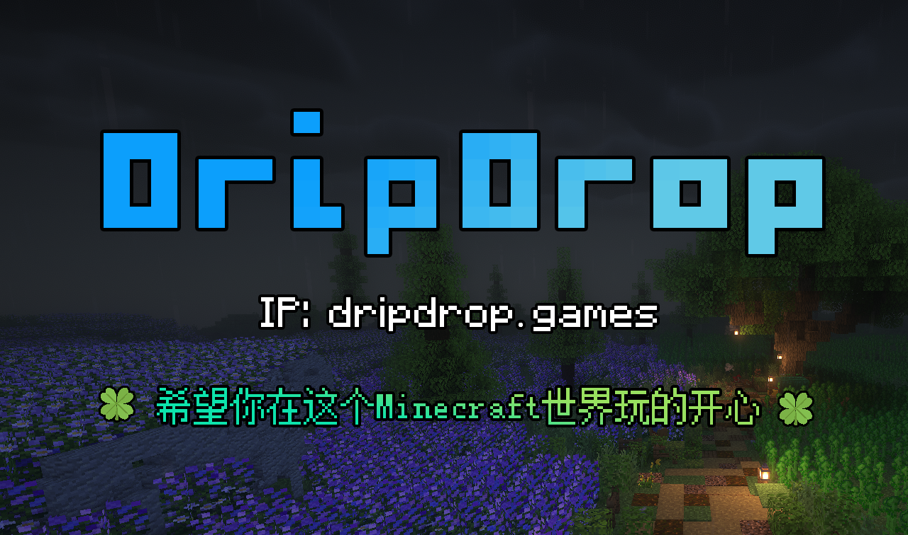

______________

## 基本信息 :id=information

+ 服务器IP：dripdrop.games
+ 维基百科：https://dripdrop.wiki/#/
+ 交流群①：[286338133](http://qm.qq.com/cgi-bin/qm/qr?_wv=1027&k=cscYY1C6ruP1Dy1AjQSERikuCJMih7kT&authKey=W4ghU66tyPRSncYrY2qDHXzq1OIp6V%2B0tesFlDj5GwrqFsB3YOO6fAxt5DSi9uzn&noverify=0&group_code=286338133)（2000人群，需qq等级1个太阳以上）
+ 交流群②：[877800025](http://qm.qq.com/cgi-bin/qm/qr?_wv=1027&k=pduoZsSaoTZBdqbYRWEB0RMXFXZKW7xR&authKey=v4kU9F5OynNLi3gTBj0mcAPGZHECBqkTzEyoAjiDm%2Bfr4KnDi35dOnoW2M%2FMrndL&noverify=0&group_code=877800025)（500人群，无限制）
+ 宣传视频：https://www.bilibili.com/video/BV18Y411A7Jy

______________

## 关于DripDrop :id=about-dripdrop

> + DripDrop，创立于2021年4月2日，已经不删档持续运营3年。
> + 服务器配置为 13700K-5.27GHz，128G固态硬盘，70M带宽，机房托管独立机。
> + 服务器采用群组服BungeeCord架构：设有引导服，生存1服，生存2服，资源服，RPG服，1.21测试服。除1.21测试服外全部子服数据互通
> + 服务器可供60名玩家游玩基本无卡顿，历史最高在线人数为127名。

> [!warning] 
> 服务器主要为建筑，生存，和轻RPG玩家服务，对部分生电做了限制。服务器可能并不适合生电玩家，重度RPG玩家

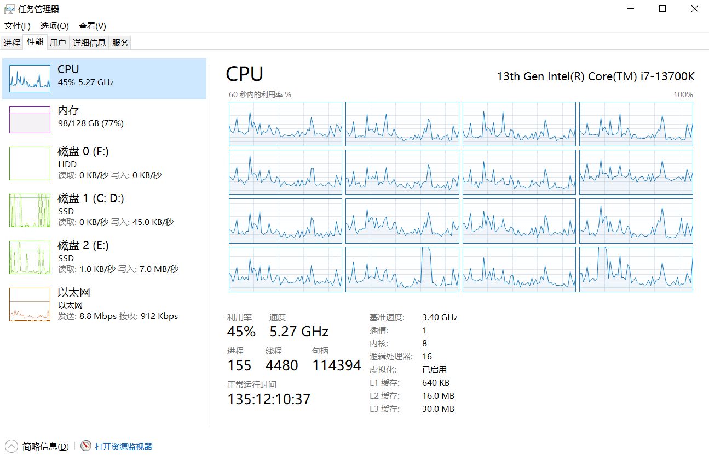
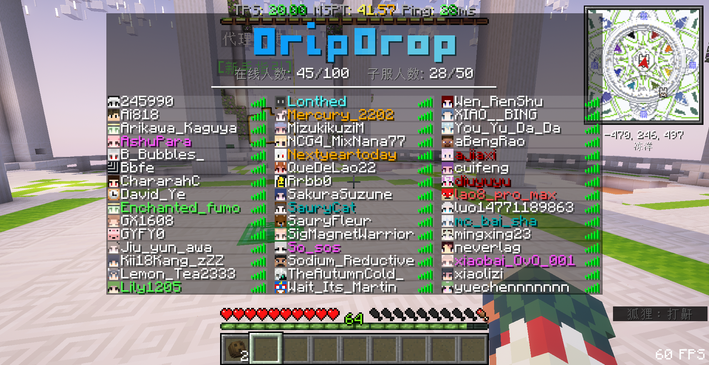

______________

## 轻松的游玩体验 :id=easy-play

+ 【点击直连】：玩家无需安装任何Mod，使用1.20.X版本的任意客户端都可加入服务器。想体验家具时装农产钓鱼等拓展内容只需要在服务器内一键安装资源包。
+ 【超远视距】：服务器视距自动调节，基本稳定在8~10之间，能看见很远的高山
+ 【经验飞行】：玩家可以用经验兑换飞行药水，在生存和资源服中想飞就飞
+ 【一键砍树】：玩家可以用任意斧头来一键砍树，一斧子下去整颗树就倒了
+ 【一键整理】：玩家可以双击背包或者箱子里面的空格子，来快速排序整理物品
+ 【血量显示】：所有怪物在收到攻击后就会显示血条HP
+ 【随身背包】：新玩家赠送一个可以携带的背包，背包连通末影箱
+ 【网页地图】：玩家可以在网页地图内查看整个服务器的世界地图，快速定位自己的位置。
+ 【签到奖励】：每日签到即可获得基础物资补给箱，每5天获得稀有物品补给箱，每7天获得传说补给箱。
+ 【领地保护】：玩家可以用木锄圈领地来保护财产，即便忘记圈领地被熊孩子破坏，15天内都能用COI插件快速复原。
+ 【便宜建材】：多次平衡调整的商店，玩家可以快捷出售/购买物品，虽然系统商店不是万能的，但购买建材会比较便宜
+ 【维基百科】：服务器的官方Wiki，为服务器的内容进行说明解释答疑，遇到服务器里面的问题都可以试试查阅wiki，或许会有帮助

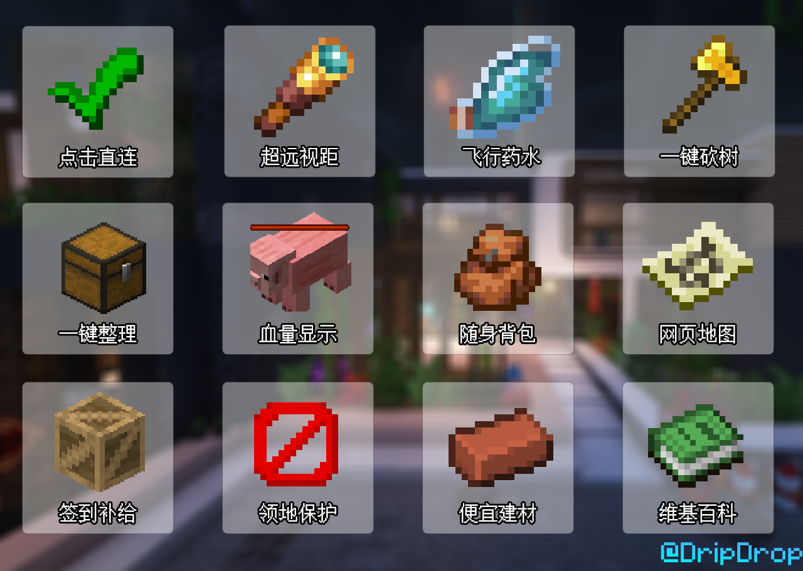

______________

## 表达个性，鼓励社交 :id=showself-and-makefriends
+ 【全服点歌】：在安装Allmusic这个mod后，玩家可以在服务器内点歌，向其他玩家分享自己喜欢的歌。
+ 【好友插件】：玩家可以在游戏内添加好友，查看好友所在的服务器，好友上线提醒，上次登录时间，以及直接跳转好友。
+ 【自定义称号】：玩家可以兑换称号面包，在铁砧里面改名，食用后即可自定义称号，让每个玩家都能展现自己的个性。
+ 【聊天表情】：玩家可以输入/emoji来发送表情包，目前有许多可爱的猫猫表情包，用表情包来传达情感。
+ 【物品/背包展示】：玩家可以输入[i]展示物品，也可以输入[inv]展示背包，向其他玩家炫耀自己的装备。
+ 【发红包抢红包】：玩家可以自行创建一个红包，大方的将游戏币分享给其他玩家，让玩家抢红包。或者创建接龙红包，让玩家成语接龙后才能领红包。
+ 【玩家传送点】：玩家可以自行创建一个传送点，可以将自己的建筑展示给其他玩家，其他玩家也可以给你的传送点进行评分点赞。
+ 【聊天屏蔽】：大部分不友善的骂人脏话会自动被屏蔽。面对不友善的玩家，你可以用/ignore来屏蔽他。面对熊孩子，可以发起投票/votemute暂时禁言，或者/voteban暂时封禁

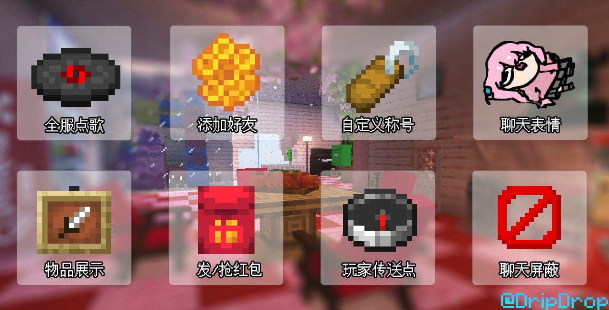
______________

## 模组般的拓展内容 :id=modlike
+ 【拓展种植】：可以购买更多的种子，比如玉米，香蕉，苹果，番茄，生菜种子，然后像原版一样种植在耕地中即可等待丰收。
+ 【更多食物】：可以购买菜刀和煎锅，在合成台中制作更多的食物，大部分拓展食物在食用后能获得一些短暂的buff效果
+ 【钓鱼比赛】：每周5，6，7这三天晚上10点开启钓鱼比赛，此时能钓上各种各样的渔产，比如易拉罐，水母，螃蟹，电鳗，甚至是鲸鱼。玩家不仅能根据鱼的品质和重量出售渔产赚钱，钓鱼比赛也设有前三名奖励和安慰奖。
+ 【时装皮肤】：可以通过各种活动，扭蛋获取物品的皮肤，将你的盔甲，剑，镐子，斧子，盾牌，甚至钓鱼竿都换成自己喜欢的皮肤。
+ 【超多家具】：在家具商店可以用游戏币购买各式各样的家具，用家具来装饰你的小屋，部分家具还具有交互，比如椅子，浴缸，饮料机，垃圾桶等等。
+ 【更多遗迹】：在资源服加入了250多种遗迹，这些遗迹往往有许多的怪物驻守和较为丰厚的奖励箱，很适合有了基础装备的萌新进行探索。
+ 【挑战BOSS】：独立的rpg服世界，可以探索寻找boss的据点，挑战boss并刷取特殊装备。目前实装的boss有冰封雪怪，哥布林剑圣，死胡子幽灵船长，海岛巨龟，巨型螃蟹，虽然不是专业的rpg服，但也在努力提供一个有趣轻松的异世界冒险体验。
+ 【特殊装备】：可以通过活动签到或者挑战boss获得，这些装备有的很强力，有的很有趣。比如能召唤骷髅的骷髅法杖，能发射剑气的库尔大刀，能发射鸡蛋的战斗鸡枪，能下雨天走的快一些的荷叶伞。

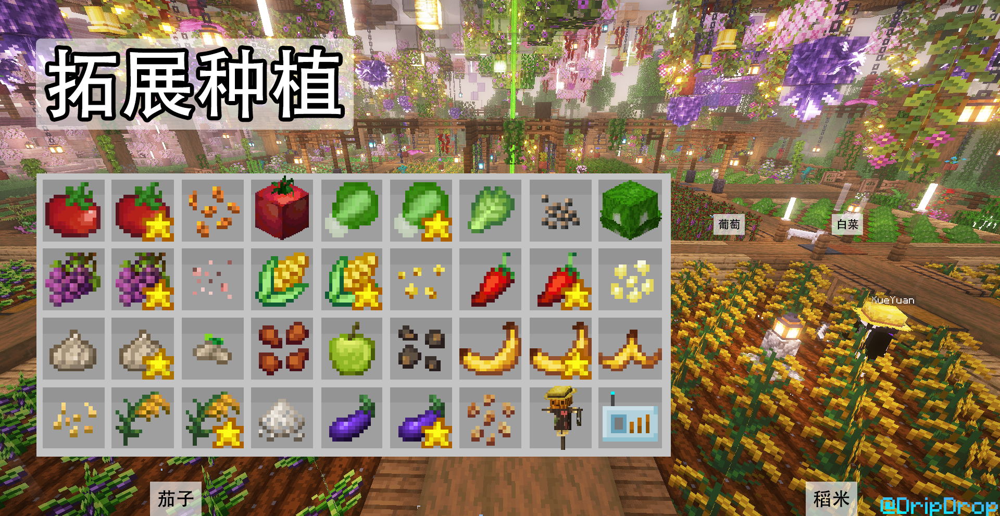
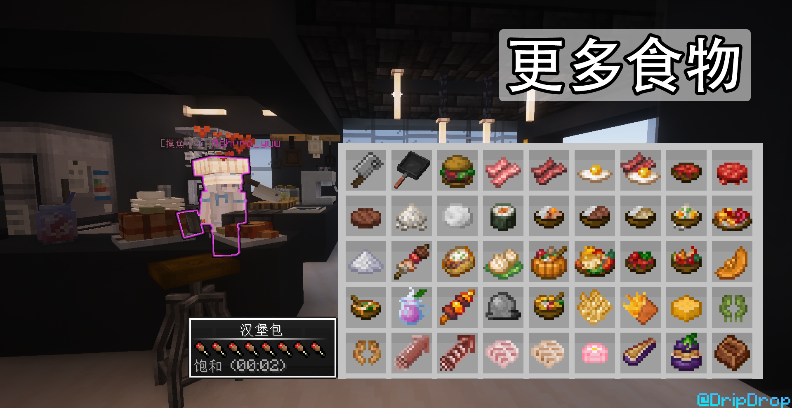
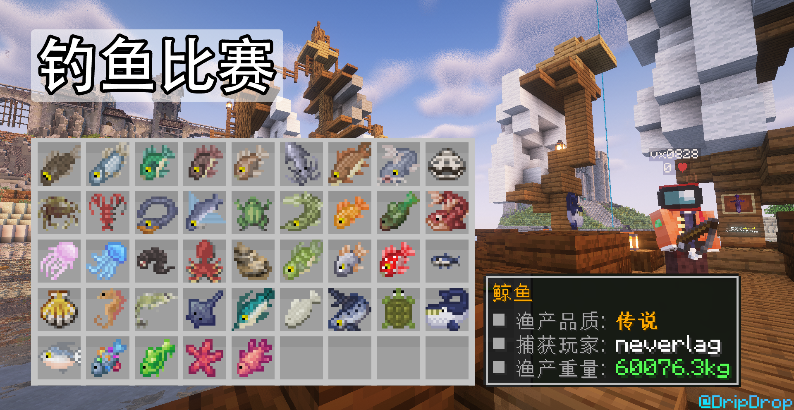
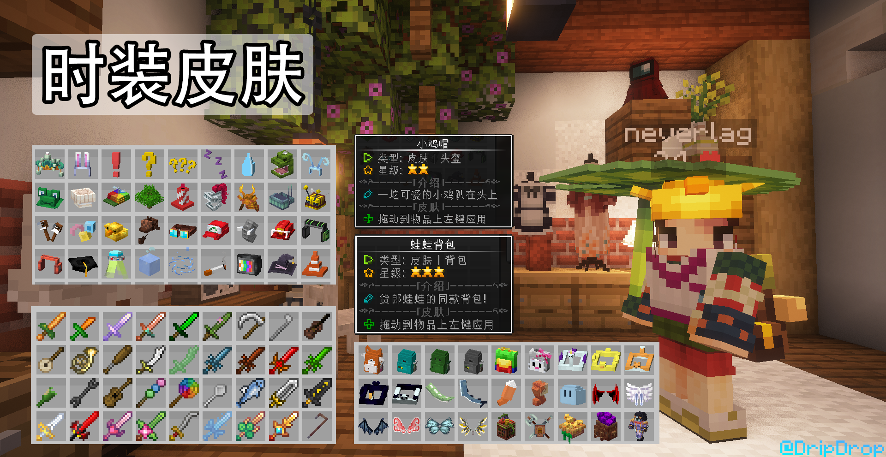
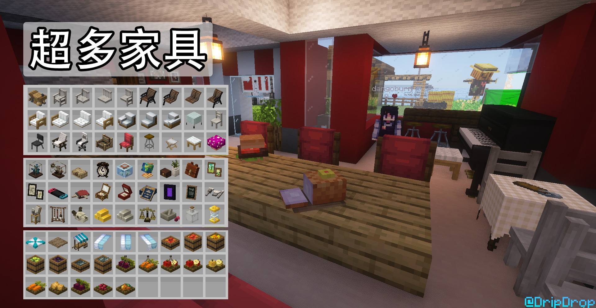
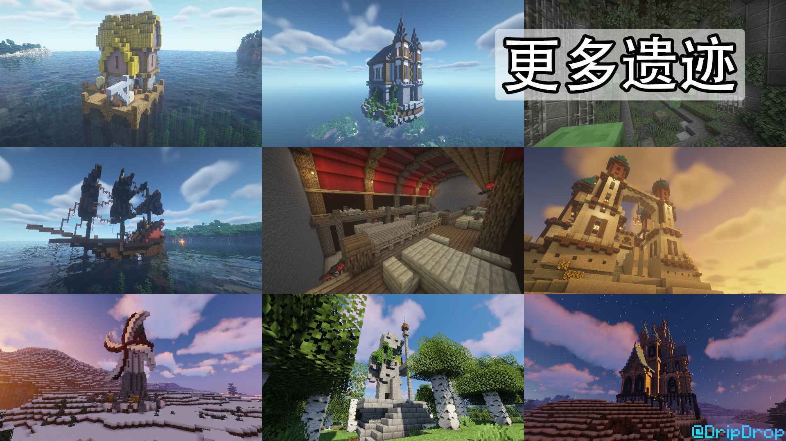
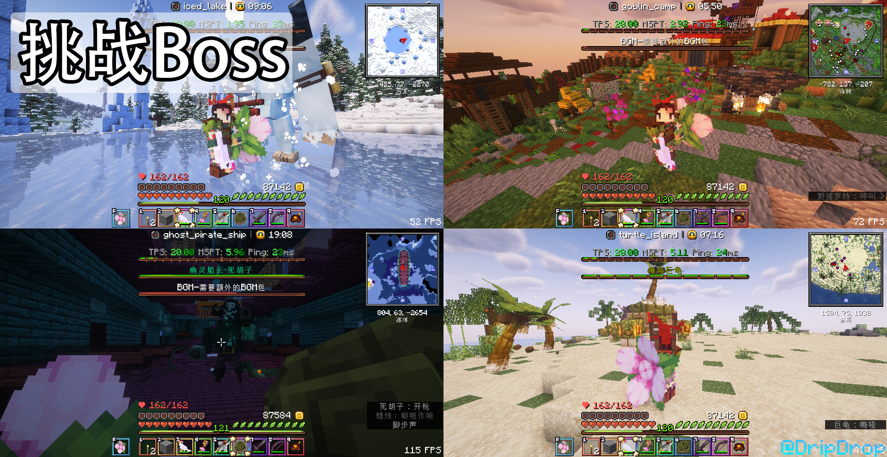
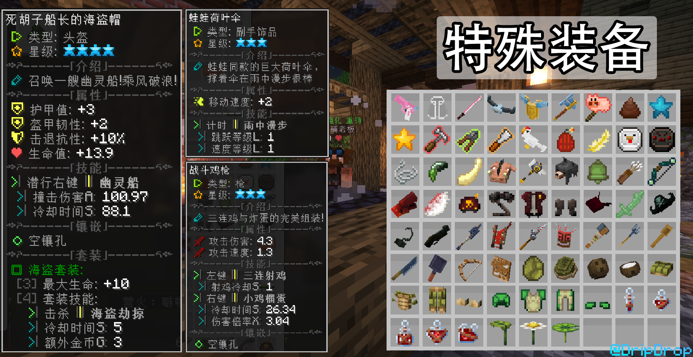

