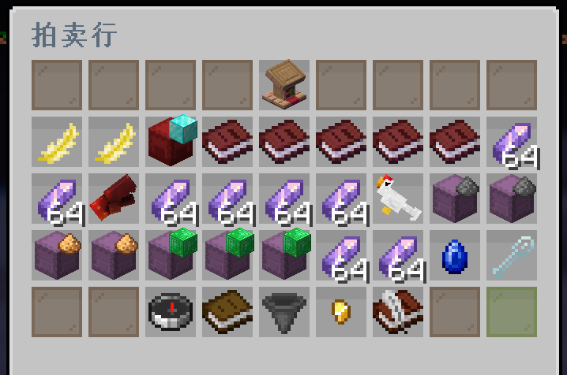
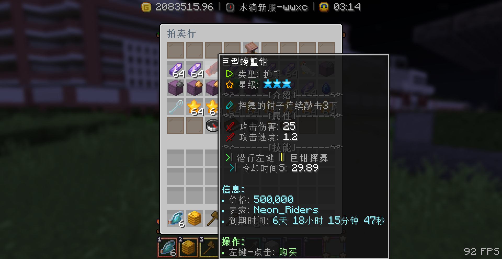
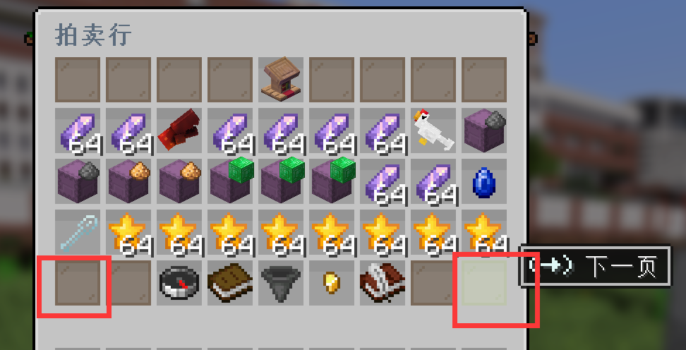
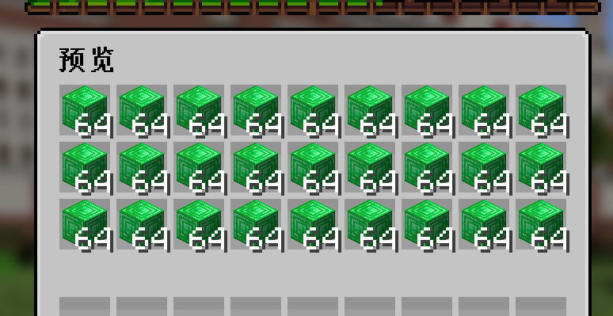
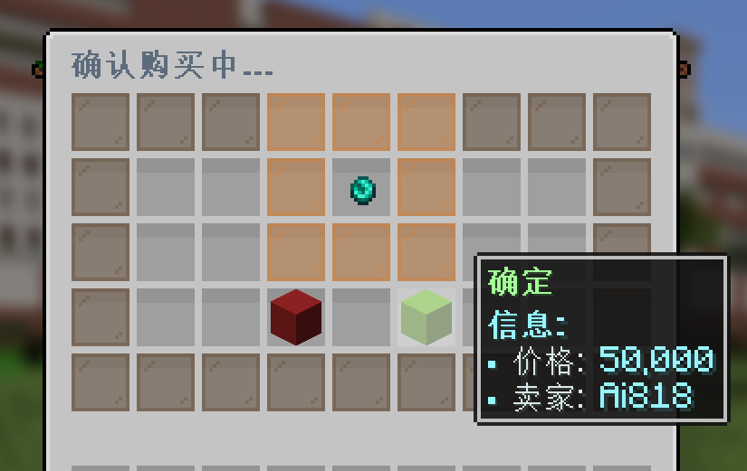

> [!note]
> + 拍卖行是一个 **高度自由** 的服内玩家交易平台。
> + 玩家可以用硬币(游戏币)交易任何游戏内获得的道具。
> + 交易的价格最低为1硬币，最高不超过1亿硬币。
> + **每个玩家最多上架10件商品**，只有商品卖出或下架才能获得空闲的商品上架名额。

## 打开拍卖行

输入指令`/auction`打开拍卖行

## 购买物品

1.将鼠标移动到商品图标上，可以查看商品信息：

2.翻页按钮在右下角和左下角

3.潜影盒商品可以右键进行预览

4.选择想要的商品，点击后需要再次确定购买

<b>🧷 点击展开，查看演示图片</b>

## 出售物品

如果你想出售物品，用**主手持有该物品**，接着输入指令`/ah sell <总售价>`并发送执行，即可将物品上架到拍卖行中。

> [!warning]
> 注意，在`/ah sell <总售价>`指令中，总售价表示所有物品的打包价格，而非单价。 
> 比如说你出售64个钻石，每个钻石卖100元，那总价是6400，你应该直接输入`/ah sell 6400`

### 出售物品的重新定价

如果玩家想要对已上架的商品进行重新定价，那么你需要将商品下架后再次上架才能重新指定价格。

在自己出售的物品中，**右键** 点击指定商品，即可下架商品：

### 已经出售的物品领取货款
上架物品被购买后需要手动领取货款，否则有可能会删除。

