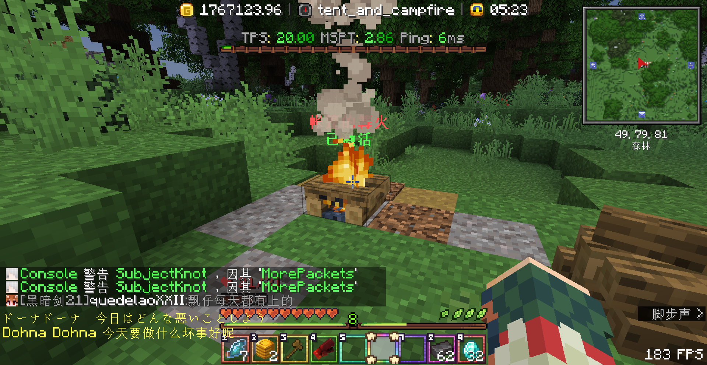
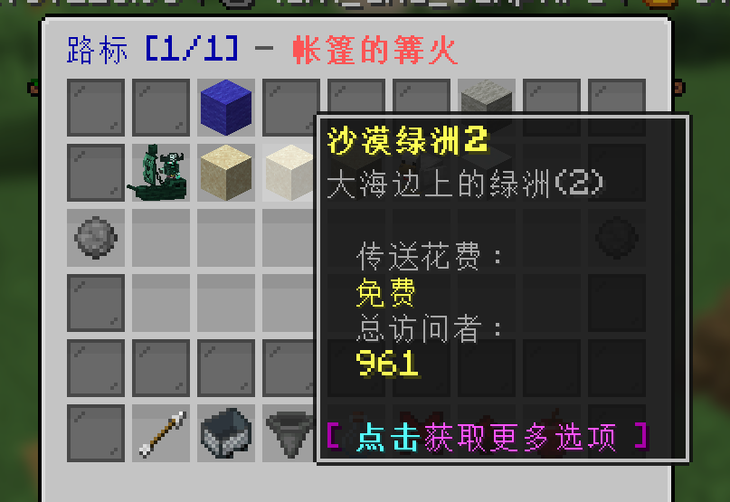
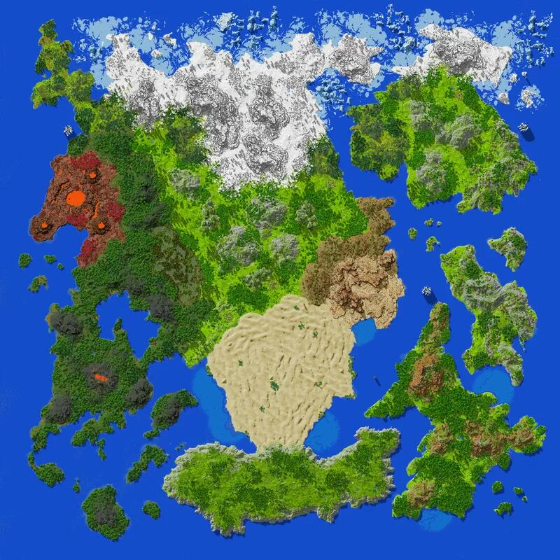
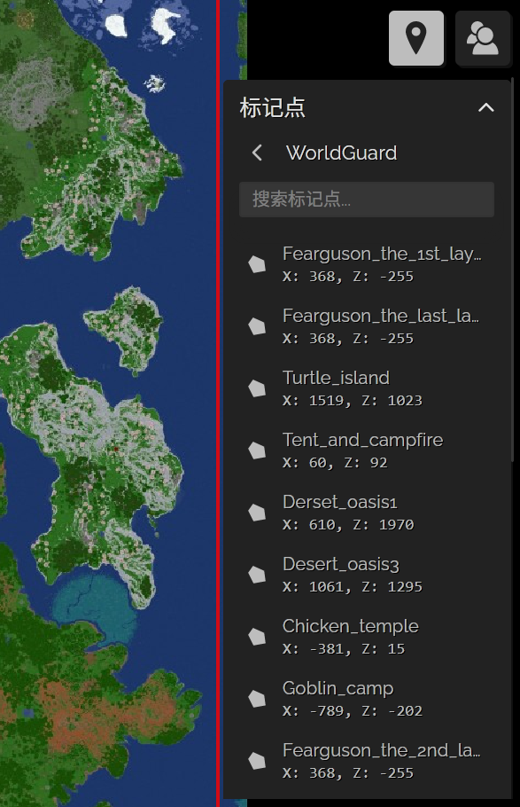
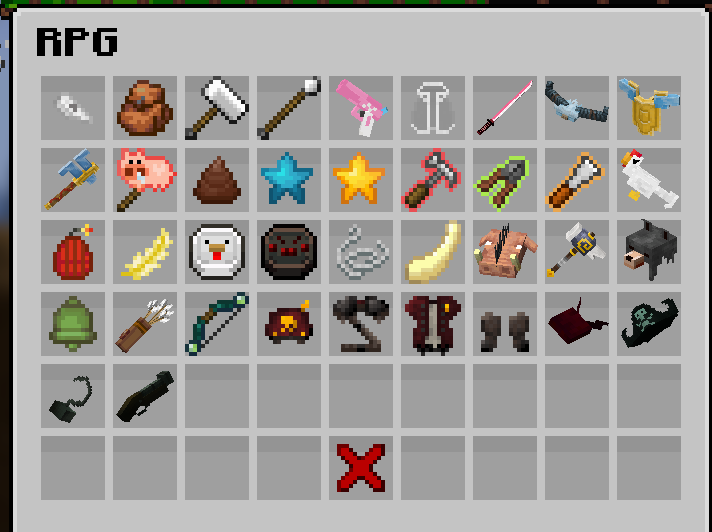

## ⚓ 地标传送 :id=waystone
点击这种野外的地标，即可激活，激活后可花费硬币在任意两个信标之间传送

## 🗺️ 世界地图 :id=dynmap
点击查看[RPG服的在线网页地图](http://map3.dripdrop.wiki)

副本服中的地标可在左上角的标记点中查看，同时也会在地图中显示边框

### 地标简介：

| 名称 | 地标id | 中心坐标 | 类型 | 出没生物 | 是否有传送锚点 | 备注 |
| ---- | ---- | ---- | ---- | ---- | ---- | ---- |
| 帐篷的篝火 | Tent_and_campfire | 60,92 | 出生点 | - | 是 | - |
| 幽灵海盗船 | Ghost_pirate_ship | 805,-2659 | BOSS区域 | 幽灵船长-死胡子、幽灵船员 | 是 | BOSS每10分钟刷新 |
| 冰封湖 | Iced_lake | -485,-2268 | BOSS区域 | 冰封雪怪 | 是 | BOSS每15分钟刷新 |
| 哥布林营地 | Goblin_camp | -789,-202 | BOSS区域 | 剑圣库尔、哥布林小兵 | 是 | BOSS每15分钟刷新 |
| 海龟岛 | Turtle_island | 1519,1023 | BOSS区域 | 海岛巨龟、小海龟、椰子树 | 是 | BOSS每15分钟刷新 |
| 沙漠绿洲1 | Desert_oasis1 | 610,1970 | 精英怪区域 | 巨型螃蟹 | 是 | 精英怪每10分钟刷新 |
| 沙漠绿洲2 | Desert_oasis2 | 1038,1696 | 精英怪区域 | 巨型螃蟹 | 是 | 精英怪每10分钟刷新 |
| 沙漠绿洲3 | Desert_oasis3 | 1061,1295 | 精英怪区域 | 巨型螃蟹 | 是 | 精英怪每10分钟刷新 |
| 死寂的村庄 | dead_village | -101,79 | 结构 | 僵尸农民、僵尸屠夫、僵尸铁匠 | 否 | - |
| 小鸡神殿 | chicken_temple | -381,15 | 结构 | 轰炸机、小飞鸡、鸡 | 是 | 生物提升到30级 |
| 白石山 | white_stone_mountain | -340,1 | 野外 | 轰炸机、小飞鸡、鸡、石头傀儡 | 否 | - |
| 青草森林 | green_grass_forest | 72,-128 | 野外 | 大青草史莱姆、青草史莱姆、小青草史莱姆、巨型蜗牛、萤火虫、萤火虫群 | 否 | - |
| 野猪森林 | boar_forest | 1519,1023 | 野外 | 凶猛野猪、猪、盗猎者、盗猎头目 | 否 | - |

## 👿 BOSS介绍 :id=boss
> [!tip]
> BOSS讨伐战仅需对BOSS造成伤害即可在BOSS被击败后随机获得战利品(~~正义群殴~~)，期间不可前往其他世界，玩家死亡亦会重置其造成伤害，BOSS血量会随参与玩家数量变化，每多一个玩家BOSS血量增加20%
 
| 名称 | 生命值 | 背景介绍 | 技能 | 被动 | 掉落 | 出没地点 | 刷新时间 |
| ---- | ---- | ---- | ---- | ---- | ---- | ---- | ---- |
| 冰封雪怪 | 4500 | 冰封湖畔的巨大黑影，响彻群山的凶恶咆哮…… | 【打雪仗】向远处的玩家投掷雪球，造成80点伤害雪怪肘击：对玩家进行近战连打撞击，每次造成120点伤害 【极寒之冰刺】对附近一定范围内所有玩家脚下生成冰刺，造成80点伤害 【掘地潜冰】雪怪向下挖掘，对远处的玩家进行地底袭击，冒出来后造成击飞 【你想堆一个雪人吗？】原地起一个大雪球，随后雪球向玩家滚去，每0.05秒造成10点真实伤害 | 50%近战减伤 60%弹射物减伤 | * 2500-3000硬币(击杀奖励) * 2500经验值的经验球(保底奖励) * 装备之星：1-2个(保底奖励) * 雪怪巨盾 * 雪怪巨斧 * 雪怪巨角 | 冰封湖 | 15分钟 |
| 幽灵船长死胡子 | 2500 | 幽灵？僵尸？此间存留的，只有无尽的死寂…… | 【冥府之唤】召唤鬼魂鹦鹉飞向玩家，造成失明 【笨蛋猪头干活了】血量低于50%时不断随机召唤一名小弟攻击玩家 【朗姆酒之魂】放置一个酒桶炸弹，引燃后踢向玩家，造成爆炸伤害 【穿刺死棘之枪】锁定目标，发动必中的一次枪击，造成150点伤害 【海蚀锈钩】使用海盗弯钩攻击玩家，造成80点伤害并附带3秒流血效果，每秒造成5点流血伤害 | 50%近战减伤 | * 1500-2000硬币(击杀奖励) * 1500经验值的经验球(保底奖励) * 1-2个战利品宝箱(保底奖励) * 死胡子弯钩 * 死胡子海盗帽 * 死胡子燧发枪 * 死胡子玩偶 | 幽灵海盗船 | 10分钟 |
| 剑圣库尔 | 一阶段1000 二阶段2500 | 被一群哥布林占领的营地 | ？ | ？ | * ？硬币(击杀奖励) * ？经验值的经验球(保底奖励) * 装备之星：1-2个(保底奖励) * 库尔的背旗 * 库尔的大长刀 | 哥布林营地 | 15分钟 |
| 海岛巨龟 | 8000 | 巨大的岛屿上生活着许多海龟 | ？ | ？ | * ？硬币(击杀奖励) * ？经验值的经验球(保底奖励) * 椰子：？个(保底奖励) * 巨龟壳碎片：？个(保底奖励) | 海龟岛 | 15分钟 |

## 👿 精英怪介绍 :id=elite
> [!tip]
> 相较于BOSS，精英怪杀死后只有一份奖励，而非全员获得。

| 名称 | 生命值 | 背景介绍 | 技能 | 被动 | 掉落 | 出没地点 | 刷新时间 |
| ---- | ---- | ---- | ---- | ---- | ---- | ---- | ---- |
| 巨型螃蟹 | 800 | 大海边上的绿洲 | 【巨钳挥舞】右钳子，连续三次敲击地面，对钳子附近4格的玩家造成80点伤害 【巨钳夹击】夹住人，造成短暂眩晕和20点伤害无视护甲的伤害，把人扔向天空 【巨钳震击】左钳子敲击地面一下，附近4格的玩家击高一点，造成40点伤害 | 60%近战减伤 60%弹射物减伤 | * 100-200硬币(击杀奖励) * 200经验值的经验球(保底奖励) * 1-5个巨螃蟹肉(保底奖励) * 巨螃蟹钳 | 沙漠绿洲1、2、3 | 10分钟 |

## 🐤 小怪介绍 :id=monsters

### 小怪简介：

| 名称 | 生命值 | 攻击力 | 介绍 | 能力 | 掉落 | 出没地点 |
| ---- | ---- | ---- | ---- | ---- | ---- | ---- |
| 凶猛野猪 | 85 | 5 | 广泛生活在平原与森林，喜欢冲撞生人 | 冲撞，往前顶，将人撞飞 | 野猪獠牙 | 平原，森林 |
| 猪 | 40 | 0 | 原先是家猪，被放生于野外 | 无 | 小猪锤(喂食)，便便(喂食) | 平原 |
| 隐形蜘蛛 | 45 | 3 | 不知如何，被赋予了隐形能力的蜘蛛 | 生成时获得三层隐身效果，每次被攻击会去掉一层 | 隐形蛛丝 | 平原 |
| 吐丝蜘蛛 | 60 | 5 | 擅长吐丝的蜘蛛，强力的蛛网甚至能捕获人类 | 吐丝 | 吐丝符咒 | 平原 |
| 剧毒蜘蛛 | 50 | 5 | 体格较小的有毒蜘蛛 | 剧毒攻击，造成中毒与延时反胃 | 蜘蛛毒牙 | 平原 |
| 盗猎者 | 125 | 7 | 森林里的不速之客 | 攻击目标使目标发光并受到伤害加深 | 猎人箭袋，盗猎者的弓 | 森林 |
| 僵尸喽啰 | 49 | 5 | 魔族怪物，总是三两成群 | 呼叫其他僵尸帮助 | 僵尸铃铛 | 村庄 |
| 僵尸杂鱼 | 49 | 5 | 随僵尸喽啰召唤而出现 | 无 | 无 | 村庄 |
| 僵尸农民 | 50 | 4 | 僵尸村庄的一员，生前擅于农耕 | 无 | 僵尸农民的镰刀，僵尸农民的草帽 | 村庄 |
| 僵尸屠夫 | 50 | 6 | 僵尸村庄的一员，生前擅于庖丁 | 无 | 僵尸屠夫的杀猪刀 | 村庄 |
| 僵尸铁匠 | 50 | 10 | 僵尸村庄的一员，生前擅于打铁 | 无 | 僵尸铁匠的铁锤 | 村庄 |
| 青草史莱姆 | 15/25/50 | 2/4/8 | 和一般的史莱姆看上去没有什么区别 | 生草 | 草 | 平原 |
| 野狼 | 40 | 2 | 普通的狼，也许皮厚了一点 | 被头狼召唤 | 野狼帽 | 平原 |
| 头狼 | 80 | 8 | 狼群头头 | 召唤野狼，流血撕咬 | 野狼帽 | 平原 |
| 鸡 | 15 | 0 | 和普通的鸡没什么两样 | 受到攻击会呼唤其他的鸡一起反击 | 鸡符咒 | 平原，白石山，小鸡神殿 |
| 小飞鸡 | 30 | 未知 | 具有攻击性的鸡 | 发射五根羽毛，造成高频伤害 | 小飞鸡的金色羽毛 | 平原，白石山，小鸡神殿 |
| 轰炸鸡 | 40 | 未知 | 具有攻击性的鸡 | 发射三个鸡弹，造成爆炸伤害 | 炸蛋，小机枪 | 平原，白石山，小鸡神殿 |
| 石头傀儡 | 385 | 15 | 平时伪装成白色陶瓦，受到攻击变形巨大傀儡 | 扔出一块石头，造成爆炸伤害 | 白色陶瓦 | 白石山 |
| 幽灵船员 | 300 | 20 | 本是海盗船上的普通船员，因诅咒而化为幽灵 | 白天来临时消失 | 僵尸船员头巾，海盗帽子，海盗上衣，海盗裤子，海盗靴子，幽灵海盗弯刀 | 幽灵海盗船 |

## 🩳 副本装备 :id=rpgitems

输入指令`/ia`查看rpg装备

| 名称 | 类型 | 星级 | 基础属性 | 可升级属性 | 升级增幅 | 能力 | 获取途径 |
| ---- | ---- | ---- | ---- | ---- | ---- | ---- | ---- |
| 僵尸农民的草帽 | 头盔 | ★ | 生命值≈2 护甲值≈1 | 生命值 | 0.2 | 无 | 击杀僵尸农民 |
| 僵尸农民的镰刀 | 剑 | ★ | 攻击伤害≈7 攻击速度≈1.6 | 攻击伤害 | 0.2 | 无 | 击杀僵尸农民 |
| 僵尸铁匠的铁锤 | 锤子 | ★ | 攻击伤害≈10 攻击速度≈1.2 | 攻击伤害 | 0.2 | 无 | 击杀僵尸铁匠 |
| 僵尸屠夫的杀猪刀 | 剑 | ★ | 攻击伤害≈8 攻击速度≈1.6 | 攻击伤害 | 0.2 | 无 | 击杀僵尸屠夫 |
| 吐丝符咒 | 符咒 | ★ | 囚禁时间≈1.5s 伤害≈10 冷却时间≈30s | 无 | 无 | 【潜行左键】囚禁并减速敌人 | 击杀吐丝蜘蛛 |
| 野猪头 | 头盔 | ★ | 生命值≈5 护甲值≈2 | 生命值 | 0.2 | 【左键】野猪冲撞，冲撞伤害≈10，冲撞速度≈5，冷却时间≈20s | 击杀凶猛野猪 |
| 野狼帽 | 头盔 | ★ | 生命值≈3 护甲值≈2 | 生命值 | 0.2 | 【攻击】造成流血伤害≈3，冷却时间≈10s | 击杀野狼、头狼 |
| 小飞鸡的金色羽毛 | 道具 | ★ | 无 | 无 | 无 | 【手持】持续缓降 【左键】向上飞行，冷却时间≈15s | 击杀小飞鸡 |
| 盗猎者的弓 | 弓 | ★★ | 攻击伤害≈10 暴击伤害加成：25% | 攻击伤害 | 0.2 | 【攻击】加深20%伤害，持续时间≈8s，冷却时间≈3s | 击杀盗猎者 |
| 猎人箭袋 | 副手饰品 | ★★ | 弹射物伤害加成≈11% | 无 | 无 | 无 | 击杀盗猎者 |
| 僵尸铃铛 | 道具 | ★★ | 僵尸伤害≈5 僵尸生命≈65 冷却时间≈45s | 无 | 无 | 【右键】召唤僵尸支援 | 击杀僵尸喽啰 |
| 僵尸船员头巾 | 头盔 | ★★ | 生命值≈2 护甲值≈2 | 生命值 | 0.2 | 无 | 击杀幽灵船员 |
| 海盗帽子 | 头盔 | ★★ | 生命值≈2 护甲值≈3 | 生命值 | 0.2 | 【套装技能】 【3】最大生命值+10 【4】【击杀生物】获得3硬币，冷却时间：5s | 击杀幽灵船员 |
| 海盗上衣 | 胸甲 | ★★ | 生命值≈6 护甲值≈6 | 生命值 | 0.2 | 同上 | 击杀幽灵船员 |
| 海盗裤子 | 护腿 | ★★ | 生命值≈5 护甲值≈5 | 生命值 | 0.2 | 同上 | 击杀幽灵船员 |
| 海盗靴子 | 靴子 | ★★ | 生命值≈2 护甲值≈3 | 生命值 | 0.2 | 同上 | 击杀幽灵船员 |
| 海盗幽灵弯刀 | 剑 | ★★ | 攻击伤害≈18 攻击速度≈1.5 | 攻击伤害 | 0.3 | 无 | 击杀幽灵船员 |
| 死胡子船长的海盗帽 | 头盔 | ★★★★ | 护甲值：3 盔甲抗性：2 击退抗性：10% 生命值≈16 | 盔甲抗性 攻击伤害 | 0.04 0.2 | 【套装技能】同上 【潜行右键】召唤幽灵船沿直线冲锋，伤害倍率：1，冷却时间≈90s | 参与击杀死胡子 |
| 死胡子铁钩 | 护手 | ★★★ | 攻击伤害≈2 攻击速度≈4 | 攻击伤害 | 0.3 | 【攻击】持续时间≈4s，额外伤害加成：30%，冷却时间≈12s | 参与击杀死胡子 |
| 死胡子燧发枪 | 枪 | ★★★ | 攻击伤害≈30 攻击速度：0.2 | 攻击伤害 | 1.2 | 【射击】造成减速，持续时间≈2s，冷却时间≈5s | 参与击杀死胡子 |
| 小猪锤 | 锤子 | ★★★ | 攻击伤害≈11 攻击速度：1.4 | 攻击伤害 | 0.3 | 【攻击】触发“小猪重锤”，持续时间≈3s，冷却时间≈9s | 喂养猪 |
| 战斗机枪 | 枪 | ★★★ | 攻击伤害≈4 | 攻击伤害 | 0.3 | 【左键】消耗耐久：9，发射三枚鸡蛋，冷却：1s 【右键】消耗耐久：30，发射一枚榴蛋，冷却：30s | 击杀轰炸鸡 |
| 雪怪巨角 | 头盔 | ★★★★ | 护甲值：3 盔甲抗性：3 击退抗性：20% 生命值≈18 移动速度：-1 | 盔甲抗性 生命值 | 0.18 0.2 | 【被攻击】减速对方，持续时间≈3s | 参与击杀冰封雪怪 |
| 雪怪巨斧 | 巨斧 | ★★★★ | 攻击伤害≈16 攻击速度≈0.9 暴击伤害加成：20% 移动速度：-2 | 攻击伤害 | 0.45 | 【潜行左键】滚雪球，滚动伤害≈1，破碎伤害≈3，冷却时间≈18s | 参与击杀冰封雪怪 |
| 雪怪巨盾 | 盾牌 | ★★★★ | 物理减免≈10% 移动速度：-2 | 物理减免 | 0.2 | 【潜行右键】治疗百分比≈20%，冷却时间≈18s | 参与击杀冰封雪怪 |
| 库尔的背旗 | 头盔 | ★★★★ | 物理伤害：+5% 护甲值：1 移动速度：+2 | 物理伤害 | 0.3 | 【被攻击】获得速度、增伤和饥饿效果，持续时间≈8s，冷却时间=20s | 参与击杀剑圣库尔 |
| 库尔的大长刀 | 剑 | ★★★★ | 攻击伤害≈20 攻击速度：1.7 | 攻击伤害 | 0.35 | 【潜行左键】释放三道剑气，伤害≈2倍攻击伤害，冷却≈15s 【左键】坠落斩，最低高度：5，伤害≈1.5倍攻击伤害，冷却≈5s 【右键】跳劈，冷却≈15s | 参与击杀剑圣库尔 |
| 哥布林的粗制大棍 | 剑 | ★ | 攻击伤害≈7 攻击速度：1.6 | 攻击伤害 | 0.2 | 无 | 击杀哥布林小兵 |
| 哥布林的破烂草叉 | 剑 | ★ | 攻击伤害≈7 攻击速度：1.6 | 攻击伤害 | 0.2 | 无 | 击杀哥布林小兵 |
| 哥布林的喝汤木勺 | 剑 | ★ | 攻击伤害≈7 攻击速度：1.6 | 攻击伤害 | 0.2 | 无 | 击杀哥布林小兵 |
| 哥布林的切肉菜刀 | 剑 | ★ | 攻击伤害≈7 攻击速度：1.6 | 攻击伤害 | 0.2 | 无 | 击杀哥布林小兵 |
| 哥布林的烹饪煎锅 | 剑 | ★ | 攻击伤害≈7 攻击速度：1.6 | 攻击伤害 | 0.2 | 无 | 击杀哥布林小兵 |
| 哥布林的破旧木弓 | 弓 | ★ | 攻击伤害≈9 暴击概率：+25% | 攻击伤害 | 0.2 | 无 | 击杀哥布林小兵 |
| 哥布林的粗糙木盾 | 盾牌 | ★ | 无 | 无 | 无 | 无 | 击杀哥布林小兵 |
