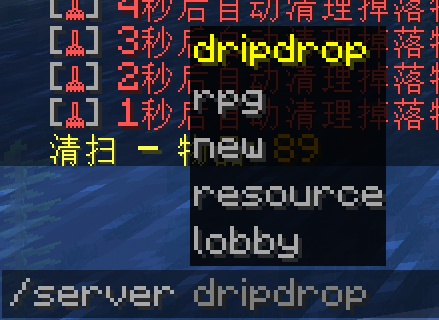
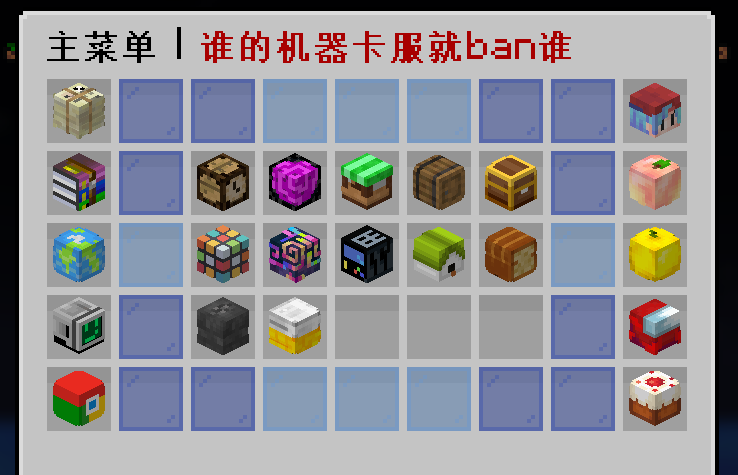

## 指令自动补全
> [!tip]
> 大部分指令在可以在输入首字母后再按 ⌨键盘上的 **Tab键** 进行自动补全。 

比如想输入`/server lobby`前往引导服

1.可以先输入`/ser`后按下Tab键,补全成`/server`

2.再按空格键 

3.按5次Tab键(或者按5次↓方向键) 切到`lobby`

4.按回车打出指令 

## 基础指令列表

| 操作               | 指令                        | 示例或说明                                                                                            |
|:-----------------|:--------------------------|:-------------------------------------------------------------------------------------------------|
| **打开服务器菜单**       | `/cd`或`/menu`             | shift键+F键也能打开菜单                                                                                  |
| **前往各个区服**       | `/server <区服名>  `         | dripdrop：主生存服，new：新生存服，rpg：副本服，resource：资源服，lobby：引导服 所有服务器数据互通                              |
| **查看账户积蓄**       | `/money`                  |                                                                                                  |
| **打钱给其他玩家**      | `/money pay <在线玩家名> <金额>` | `/money pay Dell_G3 1145141919810`                                                               |
| **创建红包**         | `/redpacket add`          | 更多配置可参阅[分享红包](redpacket.md)                                                                      |
| **查看公开传送点**      | `/warp `                  | 查看玩家所创建的传送点 warp后面不带地标名的话可以进入查看所有地表的菜单                                                       |
| **使用商店**         | `/shop`                   |                                                                                                  |
| **点歌听歌**         | `/music <网易云歌曲数字ID或链接>`   | `/music 5221167`点播[著名诈骗曲](https://music.163.com/#/song?id=5221167)，注意客户端需安装[AllMusic](/allmusic) |
| **使用表情包**        | `/e` + 空格                 | 使用上下方向键查看和选择对应表情包，按TAB键输入选中的表情包                                                                  |
| **跟玩家说悄悄话**      | `/msg <在线玩家名> <消息>`       | `/msg neverlag 我很可爱，请给我钱`                                                                        |
| **请求传送到某玩家身边**   | `/tpa <在线玩家名>`            | `/tpa neverlag`                                                                                  |
| **请求某玩家传送到自己身边** | `/tpahere <在线玩家名>`        | `/tpahere neverlag`                                                                              |
| **同意某玩家传送过来**    | `/tpaccept`               |                                                                                                  |
| **随机传送**         | `/rt`                     |                                                                                                  |
| **返回上个传送点**      | `/back`                   | 不可跨服，意味着你会返回本服上个使用过传送指令的地方                                                                       |
| **返回死亡的地点**      | `/dback`                  | 某些死亡地点会非常考验玩家的逃生手速（比如岩浆中）                                                                        |
| **前往地标**         | `/warp <地标名>`             | 可用的地标名会自动在聊天栏中显示出来，推荐使用`/warp`更直观地查看所有传送点                                                        |
| **前往领地**         | `/res tp <领地名>`           | 你需要先知道目的地的领地名称                                                                                   |
| **回家**           | `/home <家的名称>`            | 你需要先右键点击一张床设置你的家或者`/sethome <家的名称>`，单个世界可记录三个家，只有一个家时`/home`即可                                   |
| **设置家**          | `/sethome <家的名称>`         | 名称不可重复，默认为home                                                                                   |
| **回到本世界出生点**     | `/spawn`                   | 当你**卡在墙里**，**跑出边界**，**找不到人在哪**时，使用此命令可以带你回到本世界~~不一定~~安全的出生点                                      |

## 菜单代替指令

菜单功能是为了方便玩家而设置的功能，将服务器大部分功能归类整理整合在一个GUI菜单中。

通过输入指令`/cd`或者`/menu`或者按键盘⌨上`SHIFT+F`键（默认的潜行+切换副手键）打开菜单

玩家可以通过点击菜单中的头颅来进行部分指令操作，详细请看[便捷菜单](menu.md)的介绍

