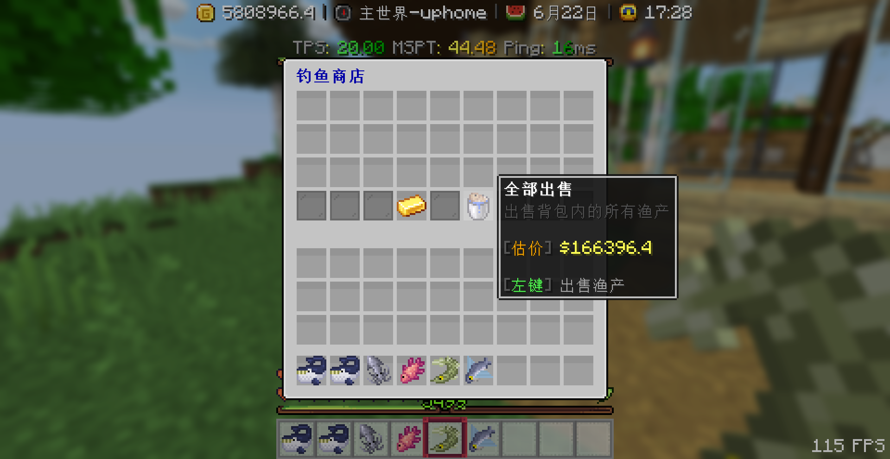

## ⏰ 比赛时间 :id=fishing-time

+ 比赛只会在周五、周六、周日这三天晚上的22:00进行比赛

+ 比赛时间为10分钟

+ 周五比赛内容为 **最重的鱼** ,比的是看谁钓上来的鱼的重量最大

+ 周六比赛内容为 **最多的鱼** ,比的是看谁钓上来的鱼最多

+ 周日比赛内容为 **总重最大** ,比的是看谁钓上来的鱼加起来的重量最大

## 🎣 参加比赛 :id=fishing-join

只需要在比赛时间内，随便找个水域，拿出你的钓鱼竿来钓鱼即可

## 🥇 排名奖励 :id=fishing-rank

+ 第一名奖励为 **50000硬币+7金鱼之盒**
+ 第二名奖励为 **30000硬币+5金鱼之盒**
+ 第三名奖励为 **10000硬币+3金鱼之盒**

+ 安慰奖(每个参与但没有名次的玩家)为 **1金鱼之盒**

## 🪣 渔产分类 :id=fishing-category

<!-- tabs:start -->

#### **垃圾**

+ 垃圾有26.5%的几率钓上

| 图标                       | 渔产(名字)                  | 重量(千克)              |
| :------------------------- | :------------------------- | :--------------------- |
|  |易拉罐 | 0.1-1              |
|  |浮木 | 1-3                 |
|  |鱼骨 | 0.1-2              |
|  |漂流瓶 | 0.1-0.4      |
|  |腐坏的钓鱼竿 | 0.1-0.4     |
|  |探险者的木船 | 3-10       |

#### **普通**

+ 普通品质的渔产有53%的几率钓上

| 图标                       | 渔产(名字)                  | 重量(千克)              |
| :------------------------- | :------------------------- | :--------------------- |
|  |蛤蜊 | 0.1-5|
|  |螃蟹 | 0.1-2|
|  |小龙虾 | 0.1-0.2|
|  |青蛙 | 0.1-3|
|  |金鱼 | 0.1-1|
|  |生蚝 | 0.2-0.8 |
|  |扇贝 | 0.3-1.5|
|  |大西洋鲱鱼 | 0.9-1.5|
|  |蓝鳃太阳鱼 | 0.5-1.2|
|  |罗非鱼 | 0.8-3|
|  |褐杉鱼 | 0.1-0.3|
|  |草鱼 | 0.5-5|
|  |石斑鱼 | 0.3-0.7|
|  |鲈鱼 | 4-7|
|  |红杉鱼 | 0.1-0.4|
|  |沙丁鱼 | 0.1-0.2|
|  |白鲳鱼 | 0.2-1.2|

#### **稀有**

+ 稀有品质的渔产有13%的几率钓上

| 图标                       | 渔产(名字)                  | 重量(千克)              |
| :------------------------- | :------------------------- | :--------------------- |
|  |鲤鱼 | 10-20|
|  |食人鱼 | 1-50|
|  |雀鳝鱼 | 15-35|
|  |电鳗 | 15-25|
|  |鲶鱼 | 3-30|
|  |乌龟 | 0.5-20 |
|  |章鱼 | 15-40|
|  |豆腐鱼 | 0.2-1|
|  |飞鱼 | 0.1-0.5|
|  |海马 | 0.1-0.2|
|  |珊瑚鱼 | 10-20       |
|  |宝石鱼 | 10-20       |
|  |海星 | 0.1-0.2       |

#### **史诗**

+ 史诗品质的渔产有6.5%的几率钓上

| 图标                       | 渔产(名字)                  | 重量(千克)              |
| :------------------------- | :------------------------- | :--------------------- |
|  |水母 | 2-200|
|  |蓝色水母 | 2-200|
|  |剑鱼 | 68-113|
|  |史莱姆鱼 | 20-30|
|  |大西洋比目鱼 | 150-210|
|  |金枪鱼 | 40-272|
|  |藏宝箱 | 10-70|

#### **传说**

+ 传说品质的渔产有1%的几率钓上

| 图标                       | 渔产(名字)                  | 重量(千克)              |
| :------------------------- | :------------------------- | :--------------------- |
|  |巨型鱿鱼 | 300-2000|
|  |蝠鲼 | 200-3400|
|  |鲸鱼 | 2000-200000|

<!-- tabs:end -->

 
## 💰 出售渔产 :id=fishing-sell

首先输入指令`/emf shop` 或者 `/fish` 打开渔产商店

### 全部出售 :id=sell-all
点击【全部出售】可以把背包内的所有渔产出售

### 部分出售 :id=sell-some
将想要出售的鱼拖到上方，点击【部分出售】可以单独出售

<!-- ## 🪱 鱼饵

> [!warning]
> 鱼饵未来更新可能会重制(有几次崩服是由于鱼饵的问题)

目前有4种鱼饵
+ 蚯蚓
+ 虾
+ 水蛭
+ 珍珠 -->

