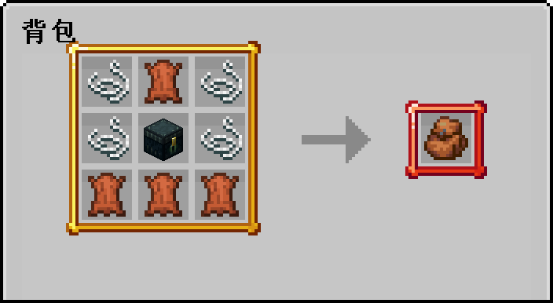

> [!note]
> 拓展物品是指利用插件制作的新物品,通常你需要安装服务器资源包才能看见它的材质
## 📖 物品图鉴

### 输入指令: `/ia` 打开图鉴

+ 第一页是物品的**类型**，点击这些图标可以跳转到具体的物品

+ 第二页是**具体物品**(下图是烹饪类型的物品)

+ 第三页是**物品配方**(下图是汉堡包的配方)

## 🔎 查找配方

> [!tip]
> 以找到汉堡的合成配方为例

1.点击图鉴书的放大镜图标

2.在告示牌上面输入`汉堡`，并点击完成

3.弹出搜索结果(如果没搜到东西，可以只搜索1个字)

4.点击物品查看配方

## 🧲 获取物品

> [!note]
> 每种拓展物品的获得方式都不相同，无法全部注明，很多需要你自己探索

### 装备皮肤
> 比如剑、稿子、钓竿、弓、弩、盔甲、盾牌
+ 一般是购买抽奖箱子，抽取各种武器装备的皮肤
+ 在某次更新中加入了部分皮肤的制作，相关功能在菜单中

### 特殊装备
> 比如巨螃蟹钳、船长弯钩、雪怪盾牌
+ 一般是通过副本挑战BOSS，在赢得胜利后，随机获得
+ 更多细节会在[挑战副本](boss.md)中说明

### 枪械子弹
> 比如R-99，R-301，克雷贝尔狙击枪，狙击子弹
+ 枪械一般是通过枪械商店购买枪械箱，然后随机抽取
+ 子弹一般是通过工作台根据配方合成获得，详见`/ia`
+ 请注意，使用过的枪械无法出售给商店
+ 另一个需要注意的点就是未使用过的枪械会被`/sellall`出售给商店

### 技能符咒
> 比如鸡符咒，蝙蝠符咒，末影人符咒
+ 目前已停止产出

### 农产种植
> 比如喷水壶，种植盆，番茄，香蕉等等
+ 目前已简化星露谷种植流程，不过依旧可以使用`/warp 喵喵村`前往去寻找相关npc来获取星星币以及购买种子

### 水产渔类
> 比如比目鱼，水母，鲸鱼
+ 一般是在周五，周六，周日晚上10点开启的钓鱼比赛中，通过钓鱼获得

### 烹饪食物
> 比如菜刀、煎锅、汉堡、饭团、牛排饭
+ 菜刀和煎锅是在喵喵村的厨师NPC用绿宝石兑换获得，现已加入工作台配方
+ 食物是根据合成配方书使用对应材料合成的
+ 有些饮料需要在`饮料机`里购买
+ 有些雪糕需要在`雪糕柜`里购买，这两个售货点都可以在家具商店购买获得

### 家具装饰
> 比如云杉木桌、白桦木板凳、黑色钢琴、瓶中之船、盆栽、挂画
+ 一般是在家具商店`/jiaju`购买
+ 有些木制桌椅需要在`木匠台`里合成

### 帽子背包
> 比如矿工帽、草帽、潜水镜、棕色小熊猫背包、青色背包
+ 帽子一般是购买抽奖箱子，抽取各种装扮
+ 背包需要通过合成获得，抽取到的是背包的皮肤

### 玩具手办
> 比如虎斑猫、小龙猫、吃蜂蜜的熊、秃鹫、鲨鱼
+ 一般是在扭蛋机`/niudan`里抽取
+ 也可以在家具商店兑换扭蛋机后放置进行抽取

### 玩家公仔
> 比如neverlag公仔、Dell_G3公仔
+ 一般是在主菜单的公仔商店里购买
+ 玩家如果想制作属于自己的公仔，需满足游戏时长500h后向neverlag申请

##  ❓ 常见问题

### 1. 为什么有些拓展物品的材质变了？

+ 有时候会删去一些物品。被删去物品的材质就会被其他材质代替
+ 有时候物品的原材料会更换。比如饮料从原来的药水(Potion)更换蜂蜜瓶(HoneyBottle)，是为了让饮料能够堆叠，这个时候材质就会改变。

### 2. 为什么拓展的农作物全部显示苹果？

+ 你可能安装了更多的进食动画mod,这个mod也是修改苹果的custommodeldata实现的，需要卸载