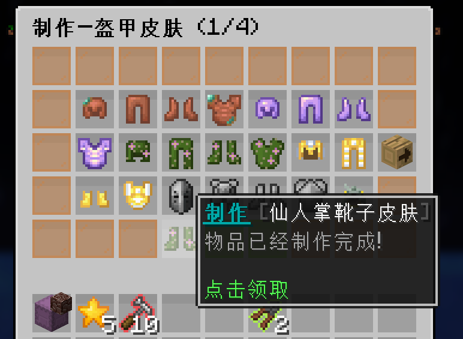
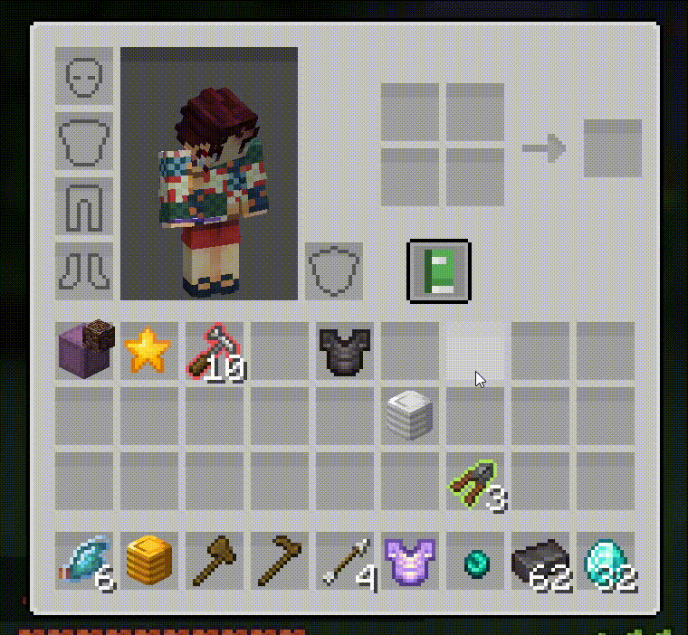

> [!note]
> + 装备皮肤类似于其他游戏中时装的玩法，需要安装[服务器资源包](resourcepack.md)才能正确显示
> + 盔甲类皮肤还需要[CITResewn](https://modrinth.com/mod/cit-resewn)这个mod确保在光影下正确显示
> + 盔甲和盾牌的皮肤能使盔甲/盾牌无法破坏(考虑到rpg中怪物伤害过高,盔甲盾牌很容易碎掉)
> + 部分稀有皮肤装备后能增加粒子特效

## 🧶 皮肤获取途径 :id=how-to-get

装备的皮肤主要有2种获得途径:

### 一. 通过购买或者活动获得的`皮肤扭蛋`进行抽取

1. 输入指令`/skin`打开皮肤制作与购买的菜单页面

2. 点击 `皮肤商店`进行购买皮肤扭蛋

3. 将扭蛋拿在手上，右键扭蛋进行抽取

<b>🧷 点击展开，查看演示图片</b>

### 二. 通过多余皮肤分解出的`皮肤之星`进行合成制作 :id=craft-skin

1. 输入指令`/skin`打开皮肤制作与购买的菜单页面

2. 点击想要制作的皮肤类型

3. 准备好材料，点击想制作的皮肤

4. 等待一定时间后领取

<b>🧷 点击展开，查看演示图片</b>

## 📃 皮肤抽取概率 :id=change

可以下载[皮肤概率的EXCEL表格](https://gitee.com/neverlag/dripdrop_wiki/releases/download/v1.0/%E7%9A%AE%E8%82%A4%E6%9E%AA%E6%A2%B0%E6%8A%BD%E5%A5%96%E6%A6%82%E7%8E%87.xlsx)进行查阅

或者在qq群286338133的群文件中 `★【服务器文档表格】` 下载 `皮肤枪械抽奖概率`

<iframe src="excel/皮肤枪械抽奖概率.htm" width="100%" height="500"></iframe>

## 👕 装备与拆卸皮肤 :id=equip-and-unequip

### 1. 装备皮肤 :id=equip

### 2. 拆卸皮肤 :id=unequip

需要先在皮肤商店购买`巧匠之钳`，再拖动到装备上进行拆卸

## ♻️ 分解重复皮肤 :id=decomposition-skin

> [!warning]
> 已知巧匠之锤在背包时一键整理可能会意外拆解副本装备，请尽量避免这种情况发生

在皮肤商店购买`巧匠之锤`，打开背包，将巧匠之锤移动到皮肤上进行分解

### 1. 皮肤分解如图所示 :id=decomposition-skin-pic

### 2. 分解的星星数根据皮肤星级而定 :id=decomposition-skin-star

| 星级                      | 最少分解数量                  | 最多分解数量              |
| :------------------------- | :------------------------- | :--------------------- |
| ⭐ |1 | 1              |
| ⭐⭐ |2 | 3                 |
| ⭐⭐⭐ |6 | 12              |
| ⭐⭐⭐⭐ |24 | 48     |
| ⭐⭐⭐⭐⭐ |64 | 128    |
| ⭐⭐⭐⭐⭐⭐ |192 | 384      |

## ❓ 常见问题 :id=itemskin-common-question

### 1. 为什么我看不见皮肤的样子 :id=cant-see-texture

+ 你没有下载最新的[服务器资源包](resourcepack.md)
+ 你的其他材质包和服务器资源包冲突了(常见的有XK的包，他的包修改了附魔的剑的材质，需要手动把他附魔剑的文件夹删除)

### 2. 为什么光影下我的盔甲皮肤是红色线条? :id=shader-bug

不开光影是正常的，开了光影是这样的话，说明你没有安装[CITResewn](https://modrinth.com/mod/cit-resewn)这个mod

