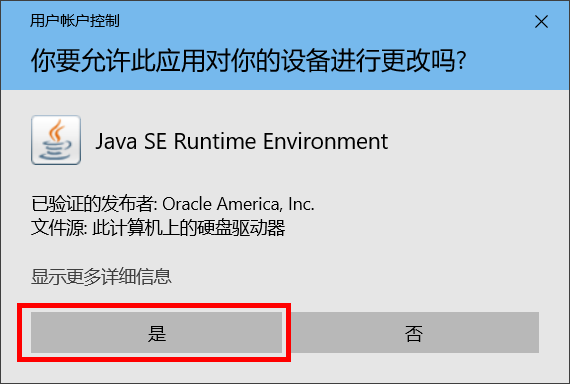
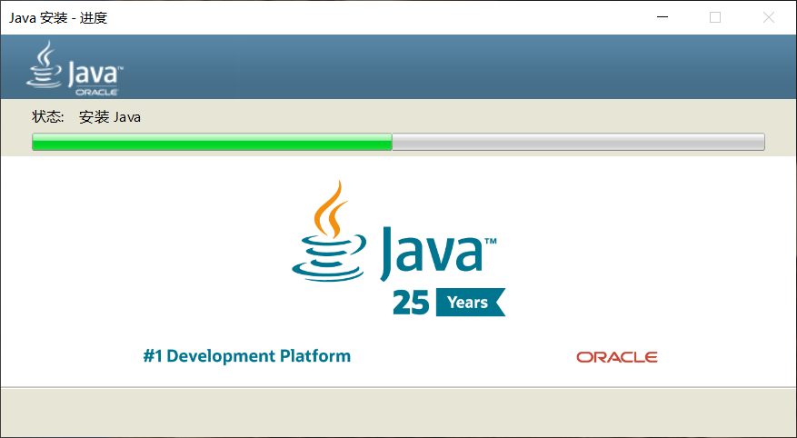
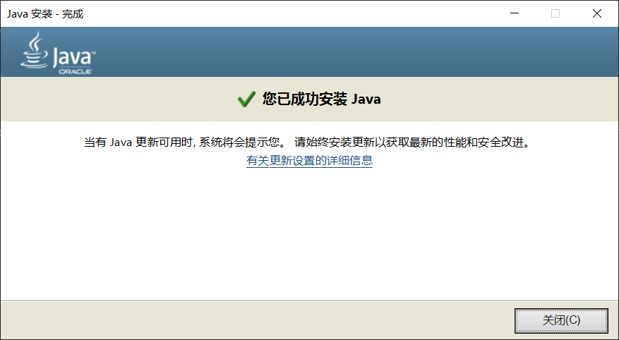
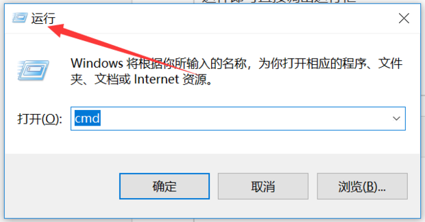
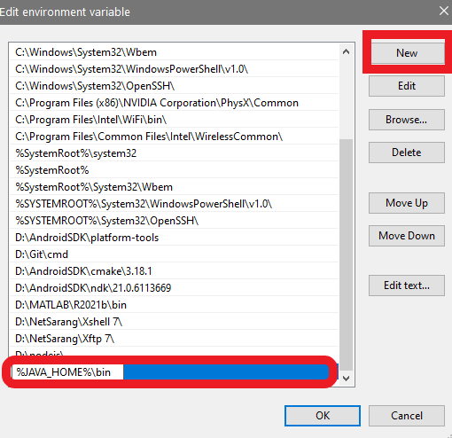

## ✅ Java版本选择 :id=choose-java

| Minecraft版本(Java版)                      | 最低启动版本                  | 推荐安装的Java版本              |
| :------------------------- | :------------------------- | :--------------------- |
| 1.7- |8 | 8              |
| 1.8~1.15 |8 | 11                 |
| 1.16 |11 | 16              |
| 1.17~1.19 |13 | 17      |
| 1.20 |17 | 17     |
| 1.21(即将到来) |21 | 未知       |

## ⬇️ 下载Java :id=download-java

> [!tip]
> 以下情况你可以跳过这一步：
> + 你已经安装了对应版本的Java
> + 你决定使用官方启动器(内置Java环境所以不用安装)进行游戏

对于不使用官方启动器的玩家而言，我们推荐从以下来源(点击跳转链接)下载Java安装包：

+ [Oracle JDK 17（只有Java 17）](https://www.oracle.com/java/technologies/javase-downloads.html)
+ [Zulu JDK（从Java 8到最新版本都有）](https://www.azul.com/downloads/?package=jdk#download-openjdk)
+ [Microsoft OpenJDK（从Java 8到最新版本都有）](https://docs.microsoft.com/zh-cn/java/openjdk/download)

## 🔧 安装Java :id=install-java

> [!warning] 
> + 强烈不建议在非oracle官网的其他网站上、下载和使用来源不明的Java安装包，此举可能会为你的计算机带来安全风险。
> + 请注意，请尽量使用当前游戏版本所要求的Java版本。既不要使用过于老旧的版本，也不需要使用太新的版本（官方都还没适配支持），否则可能会无法正常启动游戏。
+ **Windows平台玩家** 

1.从群文件下载得到 `.exe` 格式的文件之后，双击打开它（如果提示安全警告就选择 **是**）。

2.按照界面上的提示一步步操作，直到提示完成安装。

+ **Mac OS平台玩家**

Mac OS平台安装 `.dmg` 格式文件的步骤和Windows用户类似，这里不作赘述。

+ **~~Linux平台玩家~~**

~~Linux用户不会装JDK？wget指令也不会用？Java环境都不会配？那你只是纯粹拿Linux装逼的吗？~~

## ⚙️ Java环境配置 :id=java-environment

> [!tip]
> 一般来说，系统在安装Java时会自动配置好Java环境。如果玩家在安装好Java并准备进行游戏时却提示找不到Java，请参考下面的内容。

### 检查Java环境 :id=check-java-environment

+ **Windows平台玩家**

**步骤一：** 首先同时按下键盘上的 *Win* 键（*Alt* 键左边的微软标志） + *R* 键，待出现“运行”对话框后，输入`cmd`然后点击`确定`，如下图所示：

**步骤二：** 在完成步骤一之后，会出现一个命令行窗口，接着输入指令`java -version`并回车执行，如下图所示：

**步骤三：** 若出现类似于下图的结果，表明 *Java* 环境已经配置完成。

+ **Mac OS平台玩家**

Mac OS可以在系统工具中找到名为“终端”（Terminal）的命令行工具软件，类似于下图：

和Windows用户一样，在终端输入指令`java -version`并执行，如果Java环境配置正常，则同样会输出当前安装的Java版本等信息，否则按照下一节的步骤对环境变量进行配置。

### 手动配置环境变量 :id=manual-set-java-environment

+ **Windows平台玩家**

**步骤一：** 先在**桌面**或者**文件管理器**中找到“此电脑”，然后右键点击打开菜单。

**步骤二：** 选择点击最下面的“属性”选项，进入系统控制面板：

> 一些版本较新的Windows系统会进入“设置”页面，但不影响操作。

**步骤三：** 选择打开“高级系统设置”，进入系统属性窗口：

**步骤四：** 此时选择“高级”- “环境变量”：

**步骤五：** 在“系统变量”部分，点击“新建”:

然后按照下图所示（一些版本的Windows系统可能不是下图的样式，但不影响操作），在“变量名”一栏填入`JAVA_HOME`，再将Java安装所在位置的**完整目录**（例如“C:\Program Files\Java\jdk-17.0.1”）填入“变量值”一栏当中，然后点击“确定”保存退出。

**步骤六：** 还是在“系统变量”部分，选择列表中的`Path`变量，点击“编辑”，进入到下图所示的界面中。接着点击图片右边所示的“新建”，在列表中就会出现一行需要输入Java路径的文本框，然后在里面输入`%JAVA_HOME%\bin`（注意这里的JAVA_HOME就是步骤五里面添加的那个变量名称），接着一路点击确定保存，退出环境变量配置窗口即可。

最后再按照上一节的步骤，重新打开一个命令行窗口检测Java环境是否配置正常。

+ **Mac OS平台玩家**

**步骤一：** 在终端输入`which java`，查找并记住JDK的安装位置。

**步骤二：**  如果终端使用的是**bash**，输入`vim ~/ .bash_profile`；如果是**使用zsh**的就输入`vim ~/.zshrc`（通常情况下，终端窗口标题栏带有“bash”字样就是使用bash，反之为使用zsh）。上述指令用于打开系统环境配置文件，打开配置文件后，会看到类似于下图的内容：

**步骤三：**  按下键盘`i`键，进入编辑模式。利用键盘的上下左右键，<u>将光标移动到文件中最后一个“export”语句的末尾</u>，在此处回车**另起一行**。

**步骤四：**  仿照文件中的其他配置语句，输入`export JAVA_HOME=JRE安装路径`，可以参考步骤二图中所示。

**步骤五：**  按下`esc`键退出编辑模式，之后直接用键盘输入`:wq`（不用管光标的位置在哪里），即可保存环境变量配置文件，并自动返回终端的命令输入模式。

**步骤六：**  在**使用bash**的终端输入`source ~/.bash_profile`，**使用zsh**的就输入`source ~/.zshrc`。之后回车执行，环境变量配置文件开始生效。

再按照上一节的步骤，重新打开一个终端窗口输入`java -version`并执行，检查Java环境是否已经配置完毕。