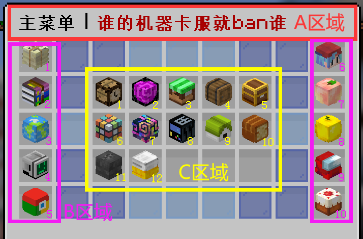

> [!note]
> + 菜单功能繁杂，此处只稍加介绍其功能类型
> + 因其略频繁变动的特性，具体情况请以服务器内为准
> + 萌新请多看看菜单，有很多功能的，熟练使用菜单能更快上手服务器

## 菜单的三个区域

菜单分成ABC三个区域，A区域是放公告的，B区域是不常用的功能，C区域是插件和各种玩法的整合

你可以对照下图的序号，大致了解菜单的功能，不过在游戏里探索能更快上手

## A区域-标题公告

通常用来写一些活动通知，更新内容通知

## B区域-非常用功能

| 序号 | 图标 | 功能 |
| :---- | :------------------------- | :--------------------- |
| 1 |报纸 | 服务器更新日志和未来更新方向              |
| 2 |压缩包 | 服务器资源包-手动安装/在线安装                 |
| 3 |地球 | 服务器选择切换              |
| 4 |电脑 | 游戏设置(一键砍树,隐形展示框,矿物监督,自动签到功能开关，服务器配置介绍)      |
| 5 |谷歌 | 服务器相关网站集合(wiki,gitee,网页地图,爱发电，kook,成就榜单,服主b站)     |
| 6 |蓝发小孩 | 好友相关功能(好友列表，好友申请处理)       |
| 7 |桃子 | 服务器小技巧       |
| 8 |金苹果 | 服务器排行榜(金钱,在线时长,睡觉,开箱次数等等)       |
| 9 |红色玩偶 | 玩家公仔出售(500小时在线时长玩家的公仔)      |
| 10 |蛋糕 | 感谢名单,所有无偿赞助过的玩家       |

## C区域-常用功能

| 序号 | 图标 | 功能 |
| :---- | :------------------------- | :--------------------- |
| 1 |木制闹钟 | 每日北京时间00:00刷新签到，可以在 B区域内的4：服务器设置 中设置为每日登录时自动签到 每签到X天(X为100的倍数)，直接获得X万硬币              |
| 2 |传送门 | 各类传送(主世界,下界,末地,服务器切换,玩家传送点,家)                 |
| 3 |绿色商店 | 系统商店总览，可以购买或出售一些物品，也是从系统获取游戏硬币的方法之一              |
| 4 |木桶 | 出货箱，可以一键出售选择的可出售物品(不过玩家更多的使用`/sellall`来一键出售背包内的可出售物品，在无法判断自己需要保留的物品是否可以出售时，请不要使用该指令)      |
| 5 |金色宝箱 | 每周任务-每周刷新的七项随机任务，完成可获得游戏硬币和实体货币**心心币**，目前，**心心币**兑换功能尚未开通     |
| 6 |魔方 | 技能-通过这样那样的事情来提升技能等级后增加玩家属性，以及掌握武器装备的主动技能 **副本服内无效**       |
| 7 |炫彩条纹方块 | 装饰特效(气球,粒子特效,怪物变身) 更多细节请[点击这里](procosmetics.md)      |
| 8 |机器 | 工具箱(垃圾桶，点歌，红包，画画等等)       |
| 9 |狗窝 | 用栓绳捕捉原版宠物，更多详情请[点击这里](mypet.md)      |
| 10 |面包 | 拓展物品的图鉴书，更多详情请[点击这里](itemsadder.md)      |
| 11 |铁砧 | 打造可以强化升级/更换皮肤材质/镶嵌宝石的装备       |
| 12 |折叠的被子 | 使用皮肤星星合成制作皮肤       |

