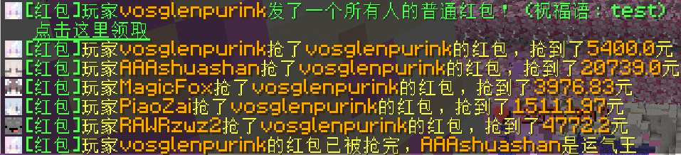
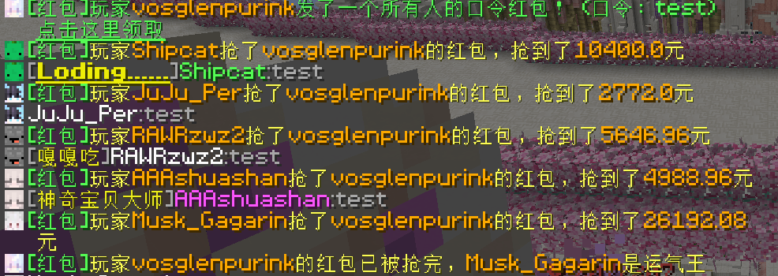
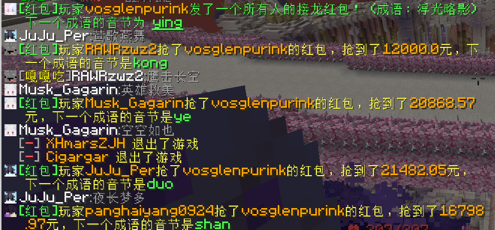

## 🧧 发红包

> [!warning]
> 目前红包只能在单个区服内领取和发送，其他区服的玩家不会收到抢红包提示，因为插件没有跨服功能

### 发红包步骤

1.输入`/redpacket add`

2.修改所有你需要自定义的参数后，点击创建即可发送，否则点击取消

| 红包类型 | 说明 |
| :---- | :------------------------- | 
| 普通(默认) |点击即可领取的红包 | 
| 口令 |需要输入对应的口令才能领取的红包 | 
| 接龙 |进行成语接龙后才能领取的红包 |

| 给予类型 | 说明 |
| :---- | :------------------------- | 
| 固定 |所有人领到相同的金额 | 
| 拼手气(默认) |每个人随机获得一定金额，有人运气不好会获得0.01元 | 

| 领取人 | 说明 |
| :---- | :------------------------- | 
| 所有人(默认) |所有人都可以领取 | 
| 指定玩家 | 输入特定玩家的id，如果要多个玩家领取，则他们的id用英文的逗号,进行分隔 | 

### 红包自动退回
未被领取的红包将在一段时间后退还

## 💴️ 领红包

> [!warning]
> 每个红包只能领取一次，成语接龙红包哪怕多次接龙也只能获得一次

### 1.普通红包

打开聊天栏点击即可领取

### 2.口令红包

输入红包发送者预先设置好的口令即可领取

### 3.成语接龙红包

根据系统给出的提示音节来输入成语即可领取

有时候也会变成这样子……不过更常见的是为所欲为

~~人类的本质是▮▮▮~~