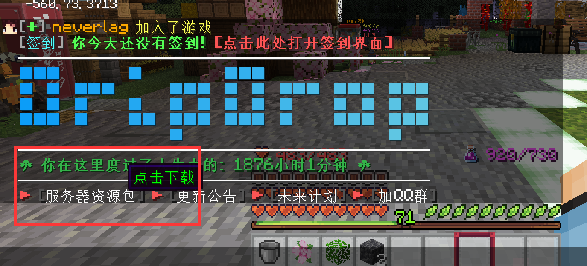
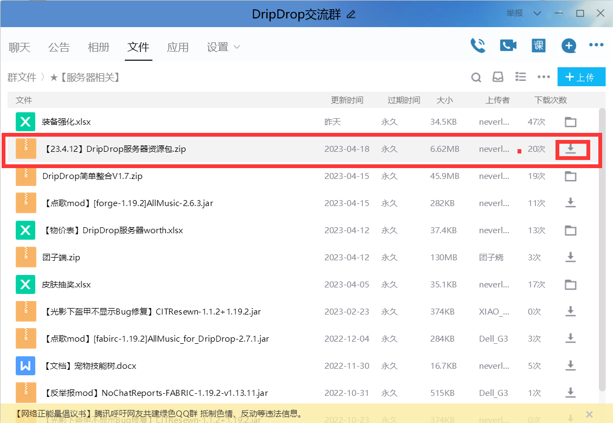
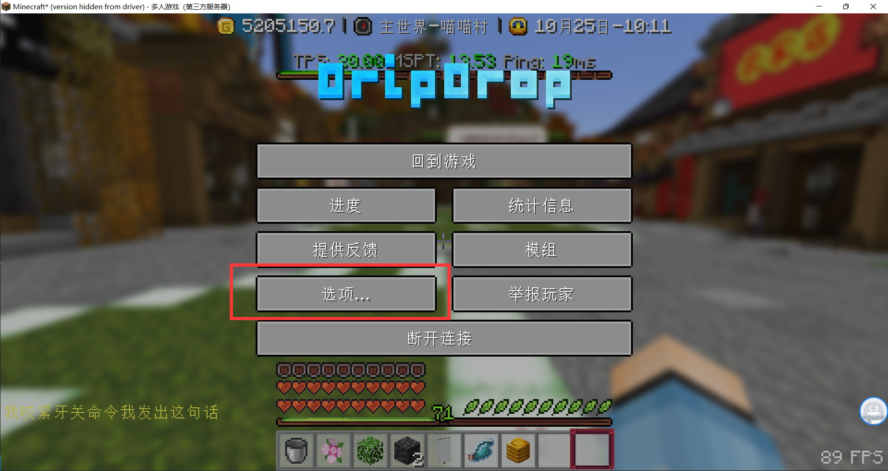
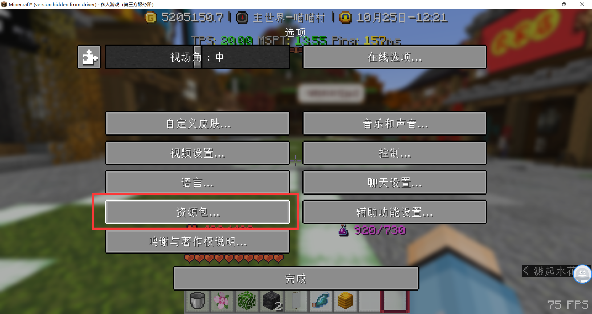
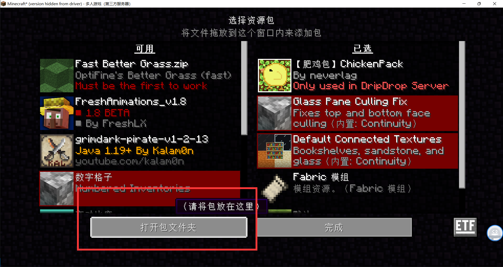
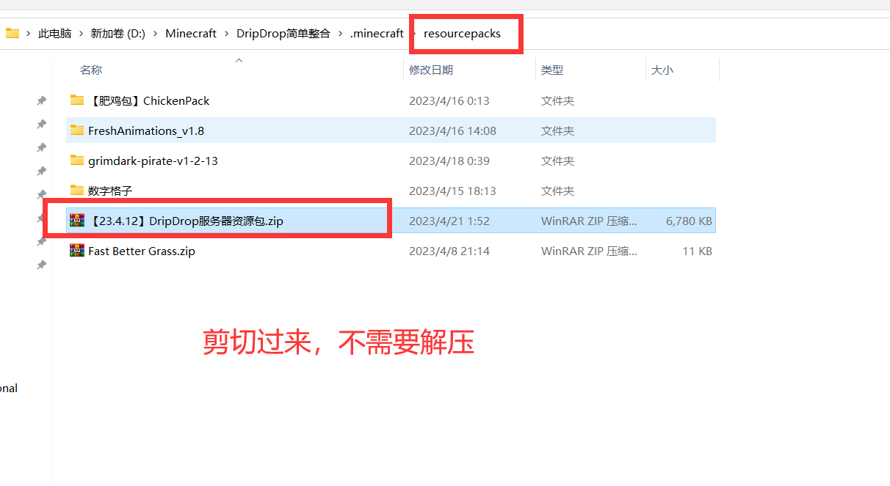
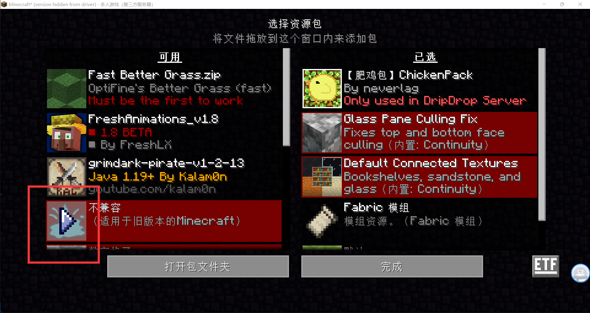
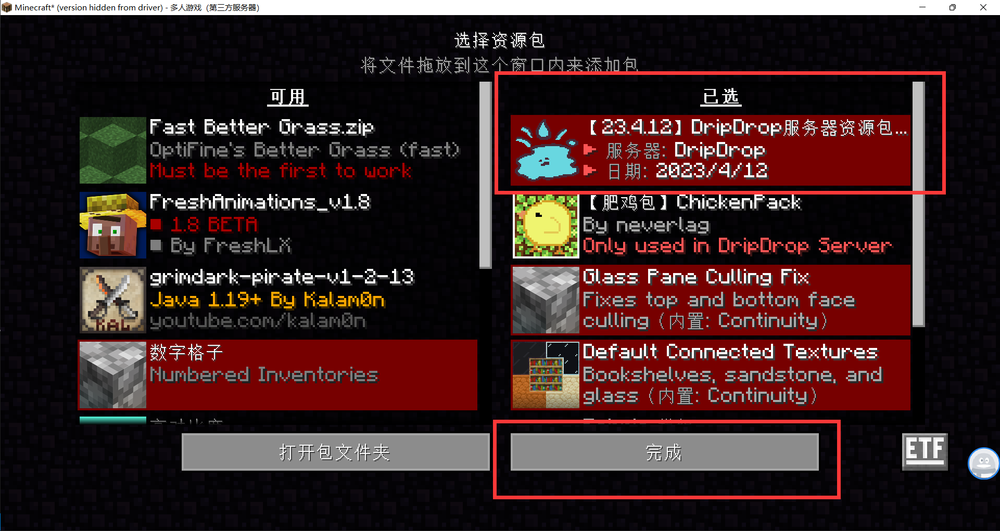

> [!tip]
> + 安装服务器资源包是为了正常显示家具、rpg武器贴图、BOSS、星露谷作物以增加游戏体验。
> + 你可以不用安装服务器材质包，这并不影响你正常游玩原版MC。但如果想体验更多的游戏内容，强烈推荐。

## 📥 在线加载

> [!warning]
> 在线加载的优点是方便快捷，缺点是每次加入退出服务器都需要一次加载。

**1. 打开聊天栏后点击服务器资源包即可自动下载**

 

**2. 输入指令`/pack`在线加载**

## 👌 手动安装(推荐)

> [!warning]
> 手动安装的优点是无需每次都要加载，缺点是服务器更新资源包后需要更换最新版本。

**1. 打开[QQ群聊](https://jq.qq.com/?_wv=1027&k=VoMxW5eI)(286338133)，点击“文件”**

**2. 打开`★【服务器资源包】`文件夹**

**3. 下载服务器资源包**

**4. 在游戏内按`ESC`打开设置页面，按`选项...`，再点`资源包...`**

**5. 点击`打开包文件夹`，并将下载的资源包文件剪切过来**

**6. 点击右箭头使服务器资源包到右侧已选,最后点击完成**

## 🆕 资源包后续更新

在每次服务器资源包更新后，将把旧的资源包直接删除，按照上述步骤重新安装新的资源包

> [!warning]
> 并非是补丁的概念，而需要重新安装

