> [!warning]
> + 追求装备的数值可能会让你失去原版的乐趣，原版生物在强化后的装备下几乎都是一刀秒杀
> + 设计强化装备的根本目的在于消耗玩家多余的钻石等资源，增加玩家的游戏时长
> + 服务器的数值设计并非完全合理，有过几次装备数值的调整，请理性对待rpg物品

## ⛓️ 获取途径 :id=how-to-get

目前有3种途径获得:

1. 用材料和硬币打造改良版装备(往下继续看)

2. 前往rpg服打败怪物有几率爆装备，点击查看[挑战副本](boss.md)的内容介绍

3. 在[拍卖行](auction.md)购买其他玩家的装备

## 🔨 打造装备 :id=craft-equipment

> [!tip]
> + 只有改良版装备和rpg装备才能进行后续的强化升级/镶嵌符咒/更换皮肤
> + 萌新建议先打造一个改良版铁剑，铁套进行强化升级后直接过渡到rpg装备或者改良版下界合金装备

### 打造装备的步骤 :id=craft-equipment-step
1. 输入指令`/equip`后点击这个铁匠头打开打造装备的页面

2. 准备好所需要的材料，点击想要打造的装备进行打造

3. 等待制作完成后，点击领取装备

<b>🧷 点击展开，查看演示图片</b>

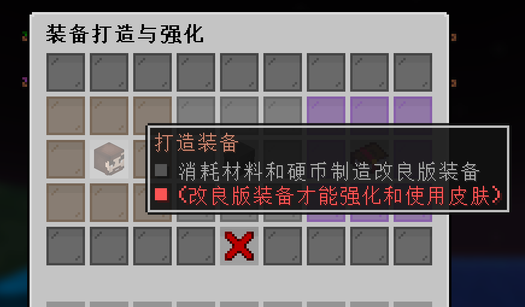

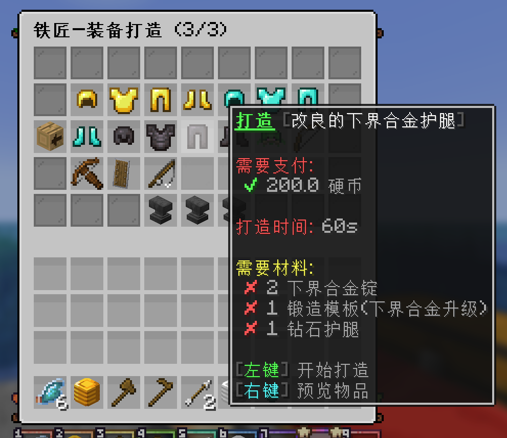

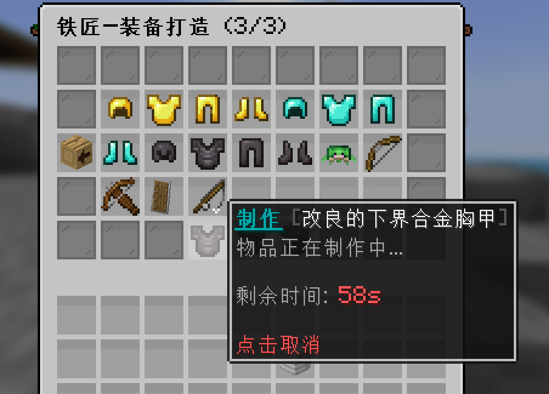

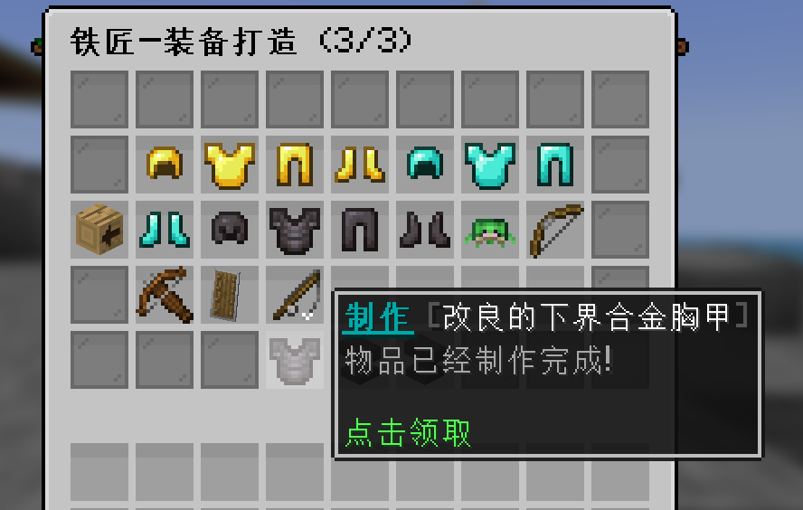

## 🗡️ 强化装备 :id=equipment-upgrade

> [!warning]
> 请背包里只放置一个需要强化的物品，比如背包里有2把改良的钻石剑，进行强化时会随机强化一个

### 强化改良版装备的步骤 :id=upgrade-normal

>[!note]
> 聊天栏里面会显示强化成功或者失败。不管成功还是失败都会扣除材料(但只有强化成功才会扣除硬币)

1. 输入指令`/equip`后点击铁砧打开强化装备的页面

2. 准备好所需要的材料，点击想要强化的装备进行强化

<b>🧷 点击展开，查看演示图片</b>

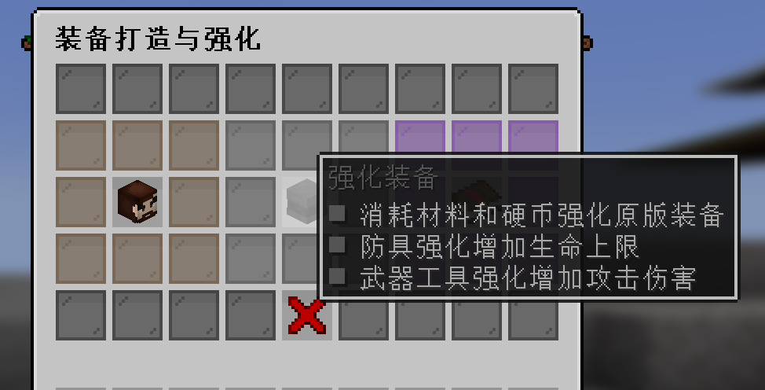

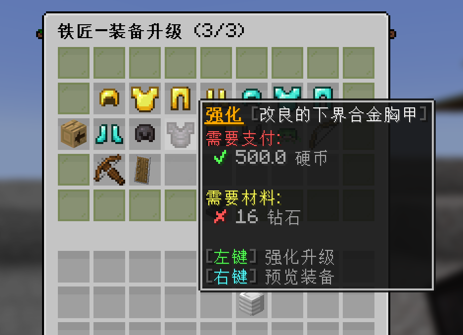

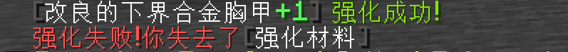

### 强化其他rpg装备的步骤 :id=upgrade-other-rpgitem

打开背包将`装备之星`移动到装备上

`装备之星`请往下看装备分解的内容

<b>🧷 点击展开，查看演示图片</b>

 
### 强化概率/增幅的excel表格下载 :id=upgrade-chance-table
3.强化的成功率/最大强化次数/强化增幅可以下载[装备强化的EXCEL表格](https://gitee.com/neverlag/dripdrop_wiki/releases/download/v1.31/%E8%A3%85%E5%A4%87%E5%BC%BA%E5%8C%96v1.31.xlsx)进行查阅

或者在qq群286338133的群文件中 `★【服务器文档表格】` 下载 `装备强化v1.31`

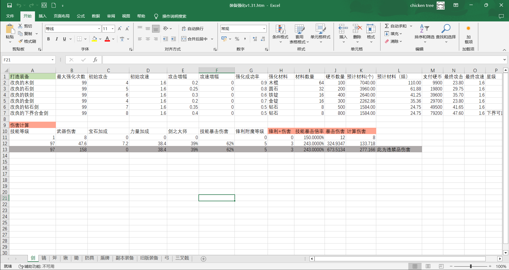

## ♻️ 装备分解 :id=equpiment-decomposition

> [!warning]
> 已知巧匠之锤在背包时一键整理可能会意外拆解副本装备，请尽量避免这种情况发生

在皮肤商店购买`巧匠之锤`，打开背包，将巧匠之锤移动到装备上进行分解

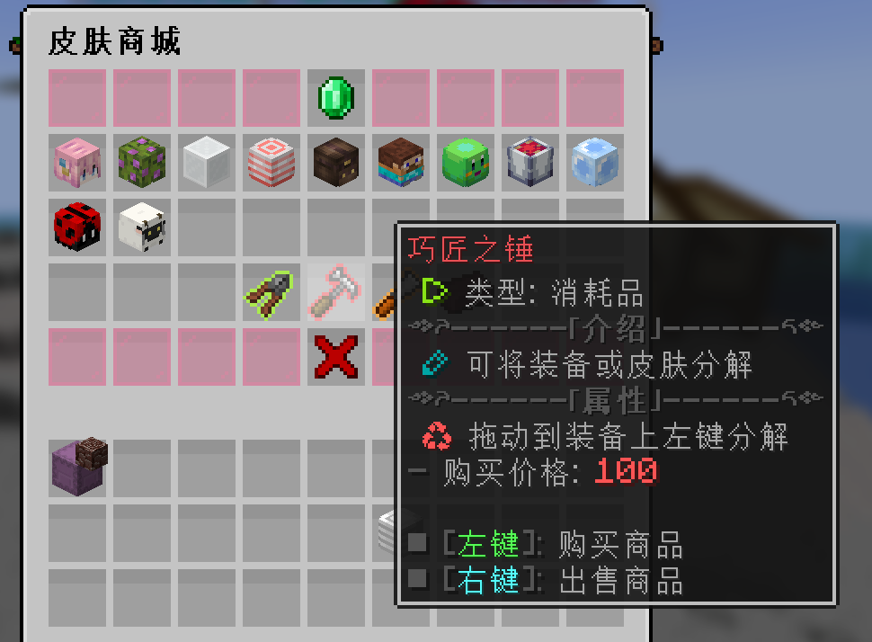

### 1. 装备分解如图所示 :id=equpiment-decomposition-pic

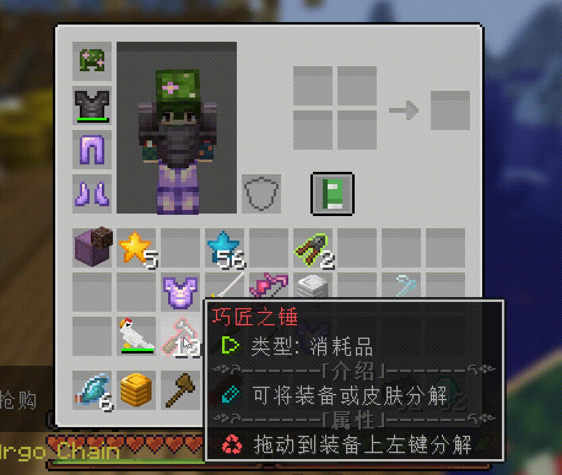

### 2. 分解的星星数根据装备星级而定 :id=equpiment-decomposition-star

| 星级                      | 最少分解数量                  | 最多分解数量              |
| :------------------------- | :------------------------- | :--------------------- |
| ⭐ |1 | 1              |
| ⭐⭐ |2 | 3                 |
| ⭐⭐⭐ |6 | 12              |
| ⭐⭐⭐⭐ |24 | 48     |
| ⭐⭐⭐⭐⭐ |64 | 128    |
| ⭐⭐⭐⭐⭐⭐ |192 | 384      |

## 💎 装备镶嵌 :id=equpiment-gem

将宝石或者符咒镶嵌在装备上，以此获得额外的属性或技能

目前宝石的成长性依然没有合理的设计(只有普通宝石和高阶宝石)，所以暂时绝版，没有开放相关内容

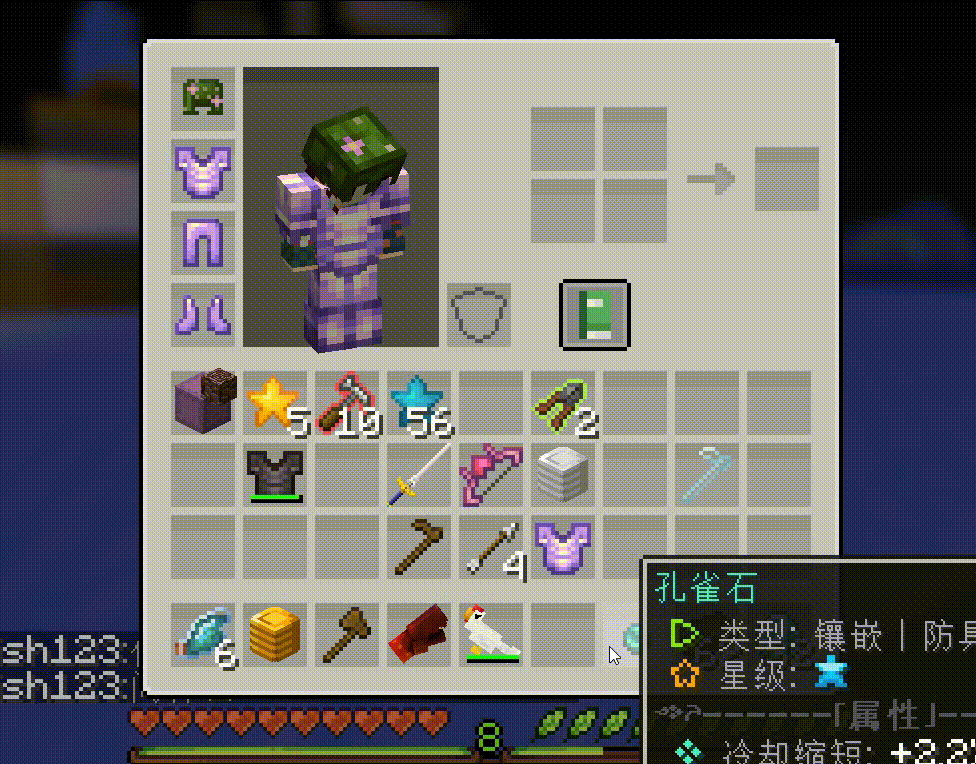

## ⚡ 装备技能 :id=equpiment-skill

RPG装备都会自带1~3个技能，可以使用对应的按键来释放技能

以小鸡枪举例，小鸡枪有2个技能，一个是【左键】发射鸡蛋，一个是【右键】释放炸弹

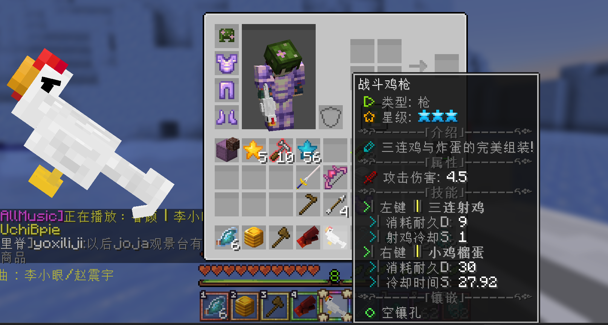

