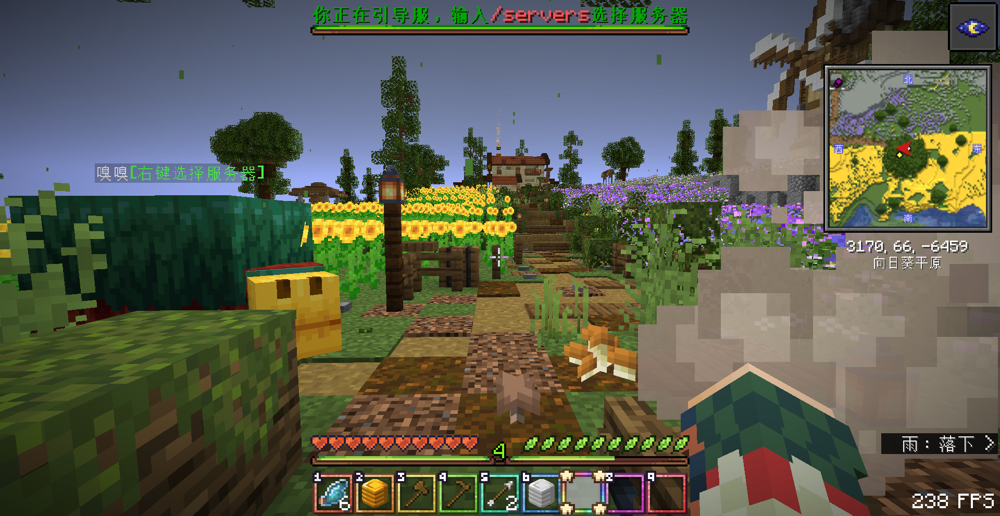
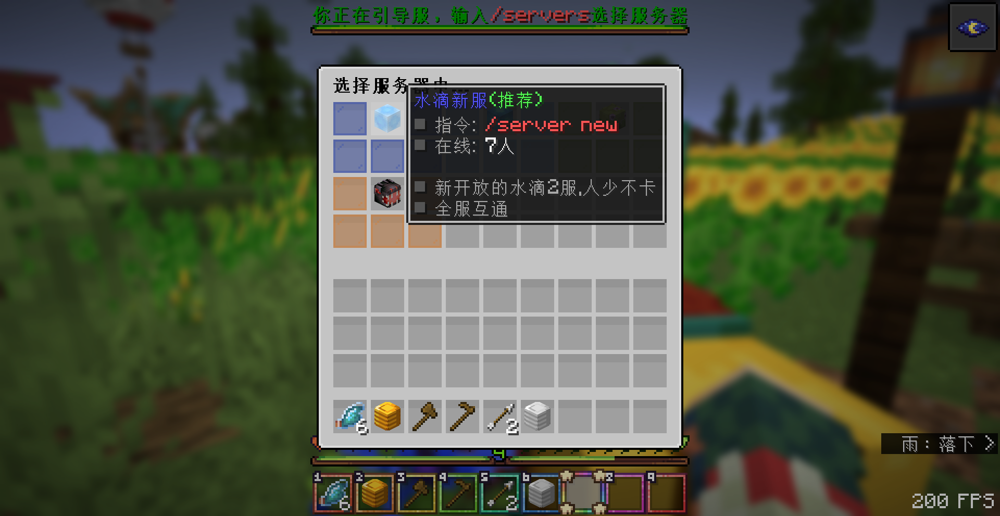
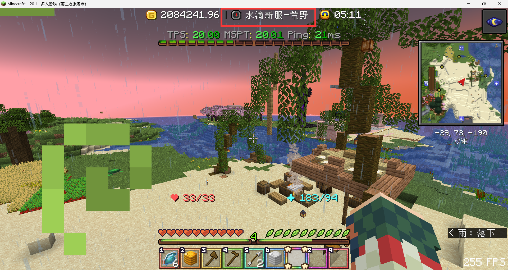

> [!tip]
> 目前一共有5个子服，所有子服的背包/末影箱/经验/游玩时长互通

## 子服列表 :id=server-list

!> 你可以通过指令`/server <服务器id>`进行切换，比如想去水滴2服就输入`/server new`

| 服务器                      | 服务器id                  | 简单介绍              |
| :------------------------- | :------------------------- | :--------------------- |
| 引导服 |lobby | 新玩家最先进入的服务器/其他服崩服后暂时接纳              |
| 水滴服 |dripdrop | 可以正常生存建家圈地，体验各种插件，但人多，基本都被圈地了               |
| 水滴新服 |new | 后开的2服，插件同水滴服，但人少一点(推荐新玩家加入)             |
| 资源服 |resource | 每周会自动刷新重置的服，可以用来挖掘资源，但不能建家     |
| RPG服 |rpg | 可以刷怪获得rpg装备和硬币     |

## 步骤演示 :id=step-demonstration

> [!tip]
> + 新玩家推荐前往水滴新服，因为这个服是后面开的，人少/机器少/领地少，服务器不卡 
> + 唯二缺点:红包和垃圾桶插件没法跨服互通，大佬一般都在1服发红包，2服领不到。1服的垃圾桶里面物资也更丰富一点

1.第一次加入服务器后会在引导服的一颗树下

2.右键点击嗅探兽或使用指令`/servers`打开服务器选择菜单

3.选择想要去的服务器并点击头颅方块进行跳转

4.成功切换服务器，注意看最上面的显示栏会说明这是哪个服

5.如果之后想切换其他服务器，同样可以使用指令`/server <服务器id>`进行切换，或者使用指令`/servers`打开服务器选择菜单

<b>🧷 点击展开，查看演示图片</b>

