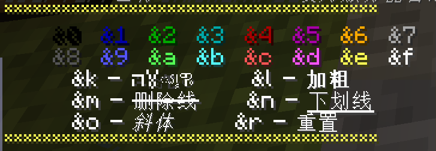
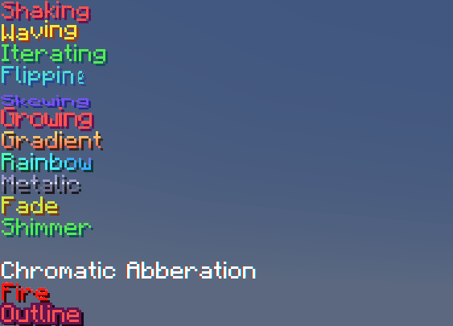
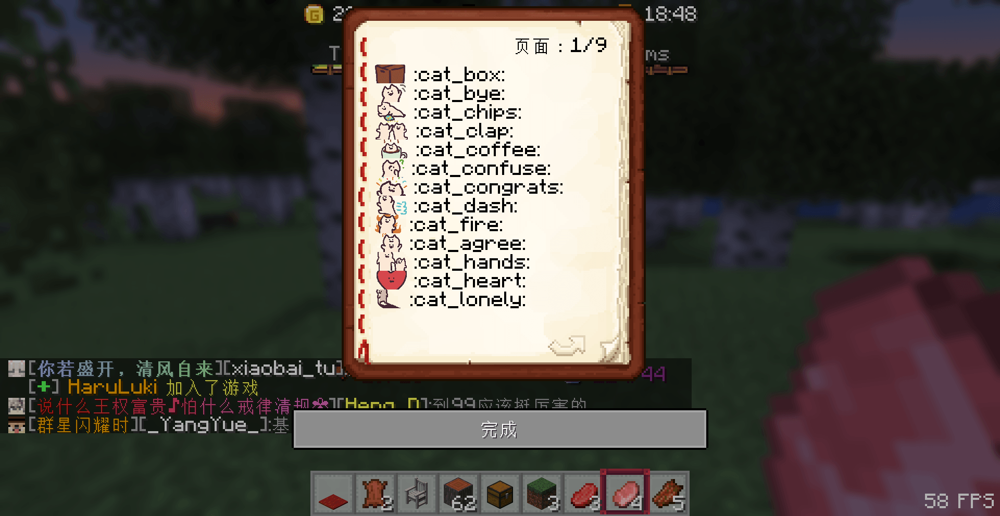
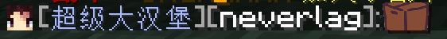
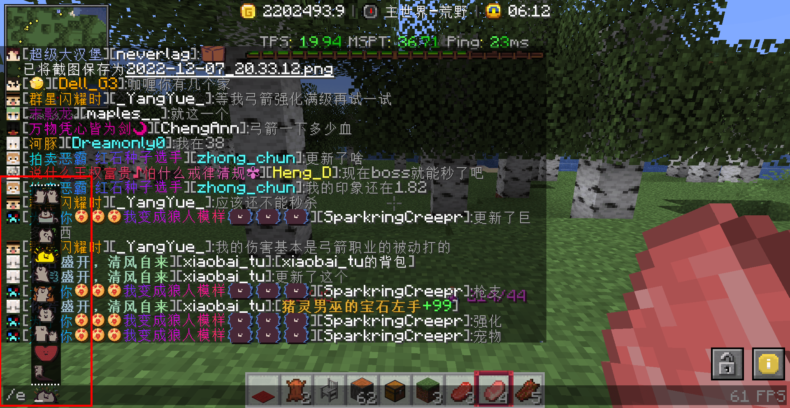
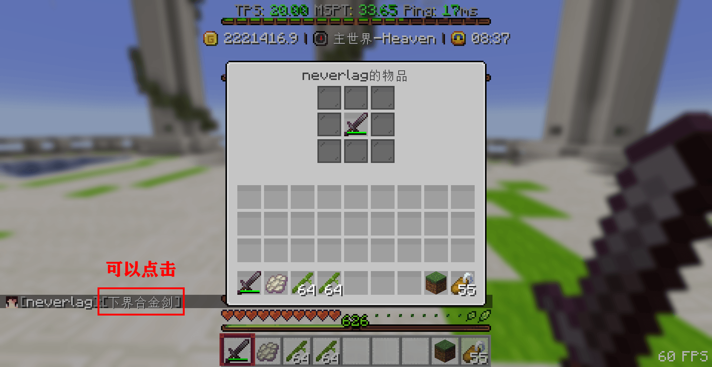
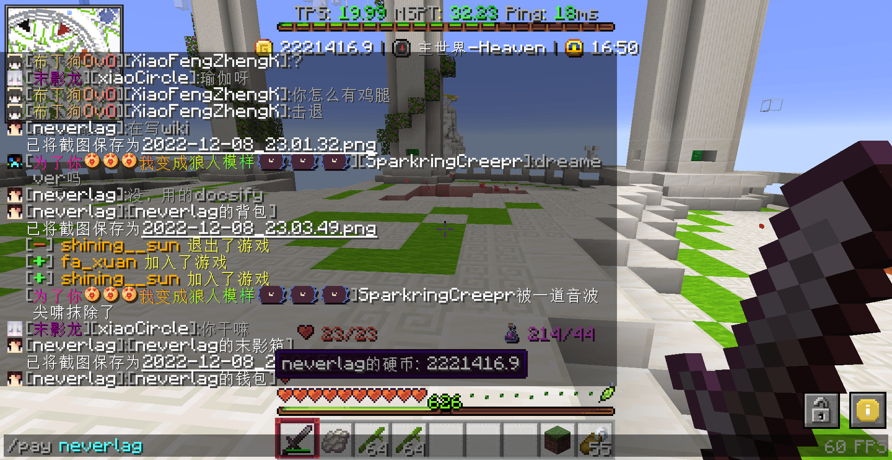

> [!tip]
> 以下特殊文本基本可以用在任何地方，包括聊天、告示牌、铁砧改名、称号等等(除了有些插件的宠物命名不支持16进制颜色)

## 🖌️ 传统颜色代码 :id=tradtional-color

+ 输入`/colors`查看传统颜色代码
+ 例子: `&9&m测试文本`将显示为 ~测试文本~

## 🎨 十六进制颜色 :id=hex-color

+ 输入`/hexcolors` 查看Hex Color(16进制颜色)
+ 例子: `{#964b00}测试文本`将显示为 测试文本

## 🖍️ 渐变颜色 :id=gradient-color

1. **简单渐变**

+ 在文本的前后分别使用两种不同的十六进制颜色，并在前面的`{}`中的最后加上`>`；后面的`{}`中的最后加入`<`即可
+ 例子:`{#0c9ffc>}这是一段会颜色渐变的文字{#60c9e7<}`

> [!warning]
> 注意例子中大于号`>`和小于号`<`的位置

2. **多次渐变**

+ 多次渐变颜色在最前面的颜色中加入`>`，中间的颜色加入`<>`，最后的颜色加入`<`
+ 例子: `{#ff0000>}这是一段会渐{#ff00d8<>}变3次的很长{#7e00ff<>}很长的文字{#0030ff<}`

## 🌟 文字特效 :id=text-effect

> [!tip]
> + 每种特效都对应的一种颜色，比如`{#F0F000}`颜色表示采用抖动(Shaking)特效 
> + 你可以复制`{#F0F000}这句话在发抖`发送到聊天栏里查看抖动特效

> [!warning]
> + 你需要安装最新的【服务器资源包】才能看见
> + 部分特效可能很晃眼睛，请尽量避免在称号上使用
> + 目前与immediatelyfast这个mod有冲突，需要暂时关闭此mod
> + 同理，如果你不想看到这些特效，请安装immediatelyfast

 |     特效英文    |  特效中文  |      对应颜色     |  例子(直接复制到聊天栏里试试)  | 
 | :------------| :----------------|:----------------|:----------------|
 | Shaking|抖动特效| {#F0F000}| `{#F0F000}Shaking`|
 | Waving |波浪特效| {#F0F004}| `{#F0F004}Waving`|
 | Iterating|迭代特效| {#F0F008}| `{#F0F008}Iterating`|
 | Flipping|翻转特效| {#F0F00C}| `{#F0F00C}Flipping`|
 | Skewing|歪斜特效| {#F0F010}| `{#F0F010}Skewing`|
 | Growing|变大特效| {#F0F030}| `{#F0F030}Growing`|
 | Gradient|渐变特效| {#F0F018}| `{#F0F018}Gradient`|
 | Rainbow|彩虹特效| {#F0F01C}| `{#F0F01C}Rainbow`|
 | Metalic|金属特效| {#F0F028}| `{#F0F028}Metalic`|
 | Fade|褪色特效| {#F0F034}| `{#F0F034}Fade`|
 | Shimmer|闪光特效| {#F0F020}| `{#F0F020}Shimmer`|
 | Blinking|闪烁特效| {#F0F038}| `{#F0F038}Blinking`|
 | Chromatic Abberation|色相差特效| {#F0F024}| `{#F0F024}Chromatic Abberation`|
 | Fire|火焰特效| {#F0F02C}| `{#F0F02C}Fire`|
 | Outline|轮廓特效| {#F0F014}| `{#F0F014}Outline`|

## 😃 emoji表情 :id=emoji

### 表情书 :id=emoji-book

1. 输入`/emoji`打开emoji表情书

2. 在聊天栏里发送 `:cat_box:` 即可发送一个箱子的表情包

3. 直接在聊天栏里使用`/e` 然后按一下`空格键`，你可以用鼠标滚轮在上面滚动选择表情包

4. 表情包实际上也是一种字体，可以在它前面使用颜色代码

## 🍩 物品展示 :id=item-show

### 展示手中物品 :id=item-show-hand

+ 在聊天栏里输入 `[i]` 即可展示手中的物品，玩家可以点击字来详细查看

### 展示背包 :id=item-show-inventory

+ 在聊天栏里输入 `[inv]` 即可展示背包物品，玩家可以点击字来详细查看

### 展示末影箱 :id=item-show-enderchest

+ 在聊天栏里输入 `[ender]` 即可展示末影箱，玩家可以点击字来详细查看

### 展示钱包 :id=item-show-money

+ 在聊天栏里输入 `[money]` 即可展示钱包
+ 鼠标放在字上会显示玩家的硬币数
+ 点击字后自动输入支付的指令

